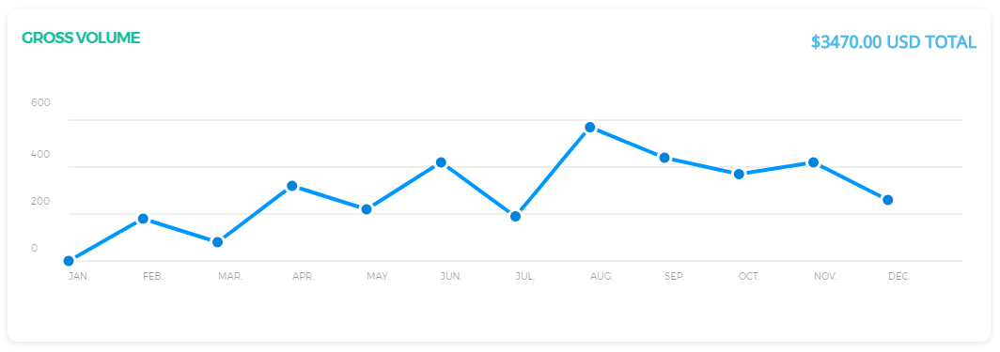
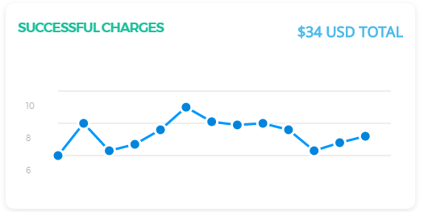
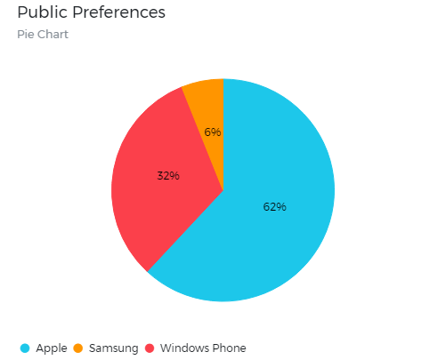
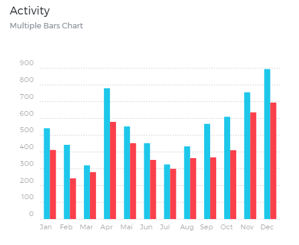
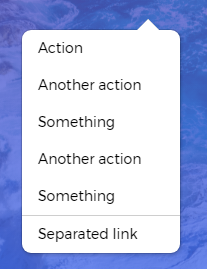
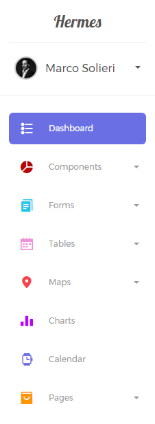

## Short summary

Besides giving the existing Bootstrap elements a new look, we added new ones, so that the interface is consistent and homogenous.

## Buttons

### Colors

We worked over the original Bootstrap classes, choosing a different, slightly intense color pallete:

<button class="btn btn-default ">Default</button>

<button class="btn btn-primary ">Primary</button>

<button class="btn btn-info ">Info</button>

<button class="btn btn-success ">Success</button>

<button class="btn btn-warning ">Warning</button>

<button class="btn btn-danger ">Danger</button>

```html
<button class="btn btn-default ">Default</button>

<button class="btn btn-primary ">Primary</button>

<button class="btn btn-info ">Info</button>

<button class="btn btn-success ">Success</button>

<button class="btn btn-warning ">Warning</button>

<button class="btn btn-danger ">Danger</button>
```

### Sizes

Buttons come in all needed sizes:

<button class="btn btn-lg ">Large</button>

<button class="btn ">Default</button>

<button class="btn btn-sm ">Small</button>

<button class="btn btn-xs ">X-Small</button>

<br>

<button class="btn btn-round btn-lg ">Large</button>

<button class="btn btn-round ">Default</button>

<button class="btn btn-round btn-sm ">Small</button>

<button class="btn btn-round btn-xs ">X-Small</button>

```html
<button class="btn btn-lg ">Large</button>

<button class="btn ">Default</button>

<button class="btn btn-sm ">Small</button>

<button class="btn btn-xs ">X-Small</button>

<br>

<button class="btn btn-round btn-lg ">Large</button>

<button class="btn btn-round ">Default</button>

<button class="btn btn-round btn-sm ">Small</button>

<button class="btn btn-round btn-xs ">X-Small</button>
```

### Styles

We added extra classes that can help you better customise the look. You can use regular buttons, filled buttons, rounded corners buttons or plain link buttons. Let's see some examples:

<button class="btn btn-wd">Default</button>

<button class="btn  btn-wd">Fill</button>

<button class="btn  btn-round btn-wd">Fill + Round </button>

<button class="btn btn-round btn-wd">Round</button>

<button class="btn btn-link btn-wd">Simple</button>


```html

<button class="btn btn-wd">Default</button>

<button class="btn  btn-wd">Fill</button>

<button class="btn  btn-round btn-wd">Fill + Round </button>

<button class="btn btn-round btn-wd">Round</button>

<button class="btn btn-link btn-wd">Simple</button>

```
### Buttons with label

<button class="btn btn-wd btn-success">
	<span class="btn-label">
		<i class="fa fa-check"></i>
	</span>
	Success
</button>

<button class="btn btn-wd btn-danger">
	<span class="btn-label">
		<i class="fa fa-times">
		</i>
		Danger
	</span>
</button>

<button class="btn btn-wd btn-info">
	<span class="btn-label">
		<i class="fa fa-exclamation">
		</i>
		Info
	</span>
</button>

<button class="btn btn-wd btn-warning">
	<span class="btn-label">
		<i class="fa fa-warning">
		</i>
		Warning
	</span>
</button>

<button class="btn btn-wd btn-default">
	<span class="btn-label">
		<i class="fa fa-arrow-left">
		</i>
		Left
	</span>
</button>

<button class="btn btn-wd btn-default">
	<span class="btn-label">
		<i class="fa fa-arrow-right">
		</i>
		Right
	</span>
</button>

```html

<button class="btn btn-wd btn-success">
	<span class="btn-label">
		<i class="fa fa-check"></i>
	</span>
	Success
</button>

<button class="btn btn-wd btn-danger">
	<span class="btn-label">
		<i class="fa fa-times">
		</i>
		Danger
	</span>
</button>

<button class="btn btn-wd btn-info">
	<span class="btn-label">
		<i class="fa fa-exclamation">
		</i>
		Info
	</span>
</button>

<button class="btn btn-wd btn-warning">
	<span class="btn-label">
		<i class="fa fa-warning">
		</i>
		Warning
	</span>
</button>

<button class="btn btn-wd btn-default">
	<span class="btn-label">
		<i class="fa fa-arrow-left">
		</i>
		Left
	</span>
</button>

<button class="btn btn-wd btn-default">
	<span class="btn-label">
		<i class="fa fa-arrow-right">
		</i>
		Right
	</span>
</button>

```
### Button Group

<div class="btn-group">
	<button type="button" class="btn btn-default">Left</button>
	<button type="button" class="btn btn-default">Middle</button>
	<button type="button" class="btn btn-default">Right</button>
</div>
<br>
<br>
<div class="btn-group">
	<button type="button" class="btn btn-default">1</button>
	<button type="button" class="btn btn-default">2</button>
	<button type="button" class="btn btn-default">3</button>
	<button type="button" class="btn btn-default">4</button>
</div>

<div class="btn-group">
	<button type="button" class="btn btn-default">5</button>
	<button type="button" class="btn btn-default">6</button>
	<button type="button" class="btn btn-default">7</button>
</div>

<div class="btn-group">
	<button type="button" class="btn btn-default">8</button>
</div>

```html
<div class="btn-group">
	<button type="button" class="btn btn-default">Left</button>
	<button type="button" class="btn btn-default">Middle</button>
	<button type="button" class="btn btn-default">Right</button>
</div>
<br>
<br>
<div class="btn-group">
	<button type="button" class="btn btn-default">1</button>
	<button type="button" class="btn btn-default">2</button>
	<button type="button" class="btn btn-default">3</button>
	<button type="button" class="btn btn-default">4</button>
</div>

<div class="btn-group">
	<button type="button" class="btn btn-default">5</button>
	<button type="button" class="btn btn-default">6</button>
	<button type="button" class="btn btn-default">7</button>
</div>

<div class="btn-group">
	<button type="button" class="btn btn-default">8</button>
</div>
```
### Pagination

<ul class="pagination">
	<li>
		<a href="#">«</a>
	</li>
	<li>
		<a href="#">1</a>
	</li>
	<li>
		<a href="#">2</a>
	</li>
	<li class="active">
		<a href="#">3</a>
	</li>
	<li>
		<a href="#">4</a>
	</li>
	<li>
		<a href="#">5</a>
	</li>
	<li>
		<a href="#">»</a>
	</li>
</ul>
<br>
<ul class="pagination no-border">
	<li>
		<a href="#">«</a>
	</li>
	<li>
		<a href="#">1</a>
	</li>
	<li>
		<a href="#">2</a>
	</li>
	<li class="active">
		<a href="#">3</a>
	</li>
	<li>
		<a href="#">4</a>
	</li>
	<li>
		<a href="#">5</a>
	</li>
	<li>
		<a href="#">»</a>
	</li>
</ul>

```html
<ul class="pagination">
	<li>
		<a href="#">«</a>
	</li>
	<li>
		<a href="#">1</a>
	</li>
	<li>
		<a href="#">2</a>
	</li>
	<li class="active">
		<a href="#">3</a>
	</li>
	<li>
		<a href="#">4</a>
	</li>
	<li>
		<a href="#">5</a>
	</li>
	<li>
		<a href="#">»</a>
	</li>
</ul>
<br>
<ul class="pagination no-border">
	<li>
		<a href="#">«</a>
	</li>
	<li>
		<a href="#">1</a>
	</li>
	<li>
		<a href="#">2</a>
	</li>
	<li class="active">
		<a href="#">3</a>
	</li>
	<li>
		<a href="#">4</a>
	</li>
	<li>
		<a href="#">5</a>
	</li>
	<li>
		<a href="#">»</a>
	</li>
</ul>
```

### Social Buttons

<div class="row">
	<div class="col-sm-4">
		<button class="btn btn-social  btn-twitter">
			<i class="fa fa-twitter"></i>
			Connect with twitter
		</button>
	</div>
	<div class="col-sm-1">	
		<button class="btn btn-just-icon btn-twitter">
			<i class="fa fa-twitter"></i>
		</button>
	</div>
	<div class="col-sm-1">
		<button class="btn btn-just-icon btn-round btn-twitter">
			<i class="fa fa-twitter"></i>
		</button>
	</div>
	<div class="col-sm-1">
		<button class="btn btn-just-icon btn-link btn-twitter">
			<i class="fa fa-twitter"></i>
		</button>
	</div>
	<div class="col-sm-5">
		<button class="btn btn-social btn-link btn-twitter">
			<i class="fa fa-twitter"></i>
			Connect with twitter
		</button>
	</div>
</div>

<div class="row">
	<div class="col-sm-4">
		<button class="btn btn-social  btn-facebook">
			<i class="fa fa-facebook-square"></i>
			Share · 2.2K
		</button>
	</div>
	<div class="col-sm-1">	
		<button class="btn btn-just-icon btn-facebook">
			<i class="fa fa-facebook"></i>
		</button>
	</div>
	<div class="col-sm-1">
		<button class="btn btn-just-icon btn-round btn-facebook">
			<i class="fa fa-facebook"></i>
		</button>
	</div>
	<div class="col-sm-1">
		<button class="btn btn-just-icon btn-link btn-facebook">
			<i class="fa fa-facebook-square"></i>
		</button>
	</div>
	<div class="col-sm-4">
		<button class="btn btn-social btn-link btn-facebook">
			<i class="fa fa-facebook-square"></i>
			Share · 2.2K
		</button>
	</div>
</div>

<div class="row">
	<div class="col-sm-4">
		<button class="btn btn-social  btn-google">
			
			Connect with google+
		</button>
	</div>
	<div class="col-sm-1">	
		<button class="btn btn-just-icon btn-google">
			<i class="fa fa-google"></i>
		</button>
	</div>
	<div class="col-sm-1">
		<button class="btn btn-just-icon btn-round btn-google">
			<i class="fa fa-google"></i>
		</button>
	</div>
	<div class="col-sm-1">
		<button class="btn btn-just-icon btn-link btn-google">
			<i class="fa fa-google"></i>
		</button>
	</div>
	<div class="col-sm-4">
		<button class="btn btn-social btn-link btn-google">
			Connect with google+
		</button>
	</div>
</div>

<div class="row">
	<div class="col-sm-4">
		<button class="btn btn-social  btn-linkedin">
			<i class="fa fa-linkedin-square"></i>
			Connect with linkedin
		</button>
	</div>
	<div class="col-sm-1">	
		<button class="btn btn-just-icon btn-linkedin">
			<i class="fa fa-linkedin"></i>
		</button>
	</div>
	<div class="col-sm-1">
		<button class="btn btn-just-icon btn-round btn-linkedin">
			<i class="fa fa-linkedin"></i>
		</button>
	</div>
	<div class="col-sm-1">
		<button class="btn btn-just-icon btn-link btn-linkedin">
			<i class="fa fa-linkedin-square"></i>
		</button>
	</div>
	<div class="col-sm-4">
		<button class="btn btn-social btn-link btn-linkedin">
			<i class="fa fa-linkedin-square"></i>
			Connect with linkedin
		</button>
	</div>
</div>

<div class="row">
	<div class="col-sm-4">
		<button class="btn btn-social  btn-pinterest">
			<i class="fa fa-pinterest"></i>
			Pin it · 212
		</button>
	</div>
	<div class="col-sm-1">	
		<button class="btn btn-just-icon btn-pinterest">
			<i class="fa fa-pinterest"></i>
		</button>
	</div>
	<div class="col-sm-1">
		<button class="btn btn-just-icon btn-round btn-pinterest">
			<i class="fa fa-pinterest"></i>
		</button>
	</div>
	<div class="col-sm-1">
		<button class="btn btn-just-icon btn-link btn-pinterest">
			<i class="fa fa-pinterest"></i>
		</button>
	</div>
	<div class="col-sm-4">
		<button class="btn btn-social btn-link btn-pinterest">
			<i class="fa fa-pinterest"></i>
			Pin it · 212
		</button>
	</div>
</div>

<div class="row">
	<div class="col-sm-4">
		<button class="btn btn-social  btn-youtube">
			<i class="fa fa-youtube-play"></i>
			view on youtube
		</button>
	</div>
	<div class="col-sm-1">	
		<button class="btn btn-just-icon btn-youtube">
			<i class="fa fa-youtube"></i>
		</button>
	</div>
	<div class="col-sm-1">
		<button class="btn btn-just-icon btn-round btn-youtube">
			<i class="fa fa-youtube"></i>
		</button>
	</div>
	<div class="col-sm-1">
		<button class="btn btn-just-icon btn-link btn-youtube">
			<i class="fa fa-youtube"></i>
		</button>
	</div>
	<div class="col-sm-4">
		<button class="btn btn-social btn-link btn-youtube">
			<i class="fa fa-youtube-play"></i>
			view on youtube
		</button>
	</div>
</div>

<div class="row">
	<div class="col-sm-4">
		<button class="btn btn-social  btn-tumblr">
			<i class="fa fa-tumblr-square"></i>
			Repost
		</button>
	</div>
	<div class="col-sm-1">	
		<button class="btn btn-just-icon btn-tumblr">
			<i class="fa fa-tumblr"></i>
		</button>
	</div>
	<div class="col-sm-1">
		<button class="btn btn-just-icon btn-round btn-tumblr">
			<i class="fa fa-tumblr"></i>
		</button>
	</div>
	<div class="col-sm-1">
		<button class="btn btn-just-icon btn-link btn-tumblr">
			<i class="fa fa-tumblr-square"></i>
		</button>
	</div>
	<div class="col-sm-4">
		<button class="btn btn-social btn-link btn-tumblr">
			<i class="fa fa-tumblr-square"></i>
			Repost
		</button>
	</div>
</div>

<div class="row">
	<div class="col-sm-4">
		<button class="btn btn-social  btn-github">
			<i class="fa fa-github"></i>
			Connect with github
		</button>
	</div>
	<div class="col-sm-1">	
		<button class="btn btn-just-icon btn-github">
			<i class="fa fa-github"></i>
		</button>
	</div>
	<div class="col-sm-1">
		<button class="btn btn-just-icon btn-round btn-github">
			<i class="fa fa-github"></i>
		</button>
	</div>
	<div class="col-sm-1">
		<button class="btn btn-just-icon btn-link btn-github">
			<i class="fa fa-github"></i>
		</button>
	</div>
	<div class="col-sm-4">
		<button class="btn btn-social btn-link btn-github">
			<i class="fa fa-github"></i>
			Connect with github
		</button>
	</div>
</div>

<div class="row">
	<div class="col-sm-4">
		<button class="btn btn-social  btn-behance">
			<i class="fa fa-behance-square"></i>
			Follow us
		</button>
	</div>
	<div class="col-sm-1">	
		<button class="btn btn-just-icon btn-behance">
			<i class="fa fa-behance"></i>
		</button>
	</div>
	<div class="col-sm-1">
		<button class="btn btn-just-icon btn-round btn-behance">
			<i class="fa fa-behance"></i>
		</button>
	</div>
	<div class="col-sm-1">
		<button class="btn btn-just-icon btn-link btn-behance">
			<i class="fa fa-behance"></i>
		</button>
	</div>
	<div class="col-sm-4">
		<button class="btn btn-social btn-link btn-behance">
			<i class="fa fa-behance-square"></i>
			Follow us
		</button>
	</div>
</div>

<div class="row">
	<div class="col-sm-4">
		<button class="btn btn-social  btn-dribbble">
			<i class="fa fa-dribbble"></i>
			Find us on dribbble
		</button>
	</div>
	<div class="col-sm-1">	
		<button class="btn btn-just-icon btn-dribbble">
			<i class="fa fa-dribbble"></i>
		</button>
	</div>
	<div class="col-sm-1">
		<button class="btn btn-just-icon btn-round btn-dribbble">
			<i class="fa fa-dribbble"></i>
		</button>
	</div>
	<div class="col-sm-1">
		<button class="btn btn-just-icon btn-link btn-dribbble">
			<i class="fa fa-dribbble"></i>
		</button>
	</div>
	<div class="col-sm-4">
		<button class="btn btn-social btn-link btn-dribbble">
			<i class="fa fa-dribbble"></i>
			Find us on dribbble
		</button>
	</div>
</div>

<div class="row">
	<div class="col-sm-4">
		<button class="btn btn-social  btn-reddit">
			<i class="fa fa-reddit"></i>
			Repost · 232
		</button>
	</div>
	<div class="col-sm-1">	
		<button class="btn btn-just-icon btn-reddit">
			<i class="fa fa-reddit"></i>
		</button>
	</div>
	<div class="col-sm-1">
		<button class="btn btn-just-icon btn-round btn-reddit">
			<i class="fa fa-reddit"></i>
		</button>
	</div>
	<div class="col-sm-1">
		<button class="btn btn-just-icon btn-link btn-reddit">
			<i class="fa fa-reddit"></i>
		</button>
	</div>
	<div class="col-sm-4">
		<button class="btn btn-social btn-link btn-reddit">
			<i class="fa fa-reddit"></i>
			Repost · 232
		</button>
	</div>
</div>

```html
<div class="row">
	<div class="col-sm-4">
		<button class="btn btn-social  btn-twitter">
			<i class="fa fa-twitter"></i>
			Connect with twitter
		</button>
	</div>
	<div class="col-sm-1">	
		<button class="btn btn-just-icon btn-twitter">
			<i class="fa fa-twitter"></i>
		</button>
	</div>
	<div class="col-sm-1">
		<button class="btn btn-just-icon btn-round btn-twitter">
			<i class="fa fa-twitter"></i>
		</button>
	</div>
	<div class="col-sm-1">
		<button class="btn btn-just-icon btn-link btn-twitter">
			<i class="fa fa-twitter"></i>
		</button>
	</div>
	<div class="col-sm-4">
		<button class="btn btn-social btn-link btn-twitter">
			<i class="fa fa-twitter"></i>
			Connect with twitter
		</button>
	</div>
</div>

<div class="row">
	<div class="col-sm-4">
		<button class="btn btn-social  btn-facebook">
			<i class="fa fa-facebook-square"></i>
			Share · 2.2K
		</button>
	</div>
	<div class="col-sm-1">	
		<button class="btn btn-just-icon btn-facebook">
			<i class="fa fa-facebook"></i>
		</button>
	</div>
	<div class="col-sm-1">
		<button class="btn btn-just-icon btn-round btn-facebook">
			<i class="fa fa-facebook"></i>
		</button>
	</div>
	<div class="col-sm-1">
		<button class="btn btn-just-icon btn-link btn-facebook">
			<i class="fa fa-facebook-square"></i>
		</button>
	</div>
	<div class="col-sm-4">
		<button class="btn btn-social btn-link btn-facebook">
			<i class="fa fa-facebook-square"></i>
			Share · 2.2K
		</button>
	</div>
</div>

<div class="row">
	<div class="col-sm-4">
		<button class="btn btn-social  btn-google">
			
			Connect with google+
		</button>
	</div>
	<div class="col-sm-1">	
		<button class="btn btn-just-icon btn-google">
			<i class="fa fa-google"></i>
		</button>
	</div>
	<div class="col-sm-1">
		<button class="btn btn-just-icon btn-round btn-google">
			<i class="fa fa-google"></i>
		</button>
	</div>
	<div class="col-sm-1">
		<button class="btn btn-just-icon btn-link btn-google">
			<i class="fa fa-google"></i>
		</button>
	</div>
	<div class="col-sm-4">
		<button class="btn btn-social btn-link btn-google">
			Connect with google+
		</button>
	</div>
</div>

<div class="row">
	<div class="col-sm-4">
		<button class="btn btn-social  btn-linkedin">
			<i class="fa fa-linkedin-square"></i>
			Connect with linkedin
		</button>
	</div>
	<div class="col-sm-1">	
		<button class="btn btn-just-icon btn-linkedin">
			<i class="fa fa-linkedin"></i>
		</button>
	</div>
	<div class="col-sm-1">
		<button class="btn btn-just-icon btn-round btn-linkedin">
			<i class="fa fa-linkedin"></i>
		</button>
	</div>
	<div class="col-sm-1">
		<button class="btn btn-just-icon btn-link btn-linkedin">
			<i class="fa fa-linkedin-square"></i>
		</button>
	</div>
	<div class="col-sm-4">
		<button class="btn btn-social btn-link btn-linkedin">
			<i class="fa fa-linkedin-square"></i>
			Connect with linkedin
		</button>
	</div>
</div>

<div class="row">
	<div class="col-sm-4">
		<button class="btn btn-social  btn-pinterest">
			<i class="fa fa-pinterest"></i>
			Pin it · 212
		</button>
	</div>
	<div class="col-sm-1">	
		<button class="btn btn-just-icon btn-pinterest">
			<i class="fa fa-pinterest"></i>
		</button>
	</div>
	<div class="col-sm-1">
		<button class="btn btn-just-icon btn-round btn-pinterest">
			<i class="fa fa-pinterest"></i>
		</button>
	</div>
	<div class="col-sm-1">
		<button class="btn btn-just-icon btn-link btn-pinterest">
			<i class="fa fa-pinterest"></i>
		</button>
	</div>
	<div class="col-sm-4">
		<button class="btn btn-social btn-link btn-pinterest">
			<i class="fa fa-pinterest"></i>
			Pin it · 212
		</button>
	</div>
</div>

<div class="row">
	<div class="col-sm-4">
		<button class="btn btn-social  btn-youtube">
			<i class="fa fa-youtube-play"></i>
			view on youtube
		</button>
	</div>
	<div class="col-sm-1">	
		<button class="btn btn-just-icon btn-youtube">
			<i class="fa fa-youtube"></i>
		</button>
	</div>
	<div class="col-sm-1">
		<button class="btn btn-just-icon btn-round btn-youtube">
			<i class="fa fa-youtube"></i>
		</button>
	</div>
	<div class="col-sm-1">
		<button class="btn btn-just-icon btn-link btn-youtube">
			<i class="fa fa-youtube"></i>
		</button>
	</div>
	<div class="col-sm-4">
		<button class="btn btn-social btn-link btn-youtube">
			<i class="fa fa-youtube-play"></i>
			view on youtube
		</button>
	</div>
</div>

<div class="row">
	<div class="col-sm-4">
		<button class="btn btn-social  btn-tumblr">
			<i class="fa fa-tumblr-square"></i>
			Repost
		</button>
	</div>
	<div class="col-sm-1">	
		<button class="btn btn-just-icon btn-tumblr">
			<i class="fa fa-tumblr"></i>
		</button>
	</div>
	<div class="col-sm-1">
		<button class="btn btn-just-icon btn-round btn-tumblr">
			<i class="fa fa-tumblr"></i>
		</button>
	</div>
	<div class="col-sm-1">
		<button class="btn btn-just-icon btn-link btn-tumblr">
			<i class="fa fa-tumblr-square"></i>
		</button>
	</div>
	<div class="col-sm-4">
		<button class="btn btn-social btn-link btn-tumblr">
			<i class="fa fa-tumblr-square"></i>
			Repost
		</button>
	</div>
</div>

<div class="row">
	<div class="col-sm-4">
		<button class="btn btn-social  btn-github">
			<i class="fa fa-github"></i>
			Connect with github
		</button>
	</div>
	<div class="col-sm-1">	
		<button class="btn btn-just-icon btn-github">
			<i class="fa fa-github"></i>
		</button>
	</div>
	<div class="col-sm-1">
		<button class="btn btn-just-icon btn-round btn-github">
			<i class="fa fa-github"></i>
		</button>
	</div>
	<div class="col-sm-1">
		<button class="btn btn-just-icon btn-link btn-github">
			<i class="fa fa-github"></i>
		</button>
	</div>
	<div class="col-sm-4">
		<button class="btn btn-social btn-link btn-github">
			<i class="fa fa-github"></i>
			Connect with github
		</button>
	</div>
</div>

<div class="row">
	<div class="col-sm-4">
		<button class="btn btn-social  btn-behance">
			<i class="fa fa-behance-square"></i>
			Follow us
		</button>
	</div>
	<div class="col-sm-1">	
		<button class="btn btn-just-icon btn-behance">
			<i class="fa fa-behance"></i>
		</button>
	</div>
	<div class="col-sm-1">
		<button class="btn btn-just-icon btn-round btn-behance">
			<i class="fa fa-behance"></i>
		</button>
	</div>
	<div class="col-sm-1">
		<button class="btn btn-just-icon btn-link btn-behance">
			<i class="fa fa-behance"></i>
		</button>
	</div>
	<div class="col-sm-4">
		<button class="btn btn-social btn-link btn-behance">
			<i class="fa fa-behance-square"></i>
			Follow us
		</button>
	</div>
</div>

<div class="row">
	<div class="col-sm-4">
		<button class="btn btn-social  btn-dribbble">
			<i class="fa fa-dribbble"></i>
			Find us on dribbble
		</button>
	</div>
	<div class="col-sm-1">	
		<button class="btn btn-just-icon btn-dribbble">
			<i class="fa fa-dribbble"></i>
		</button>
	</div>
	<div class="col-sm-1">
		<button class="btn btn-just-icon btn-round btn-dribbble">
			<i class="fa fa-dribbble"></i>
		</button>
	</div>
	<div class="col-sm-1">
		<button class="btn btn-just-icon btn-link btn-dribbble">
			<i class="fa fa-dribbble"></i>
		</button>
	</div>
	<div class="col-sm-4">
		<button class="btn btn-social btn-link btn-dribbble">
			<i class="fa fa-dribbble"></i>
			Find us on dribbble
		</button>
	</div>
</div>

<div class="row">
	<div class="col-sm-4">
		<button class="btn btn-social  btn-reddit">
			<i class="fa fa-reddit"></i>
			Repost · 232
		</button>
	</div>
	<div class="col-sm-1">	
		<button class="btn btn-just-icon btn-reddit">
			<i class="fa fa-reddit"></i>
		</button>
	</div>
	<div class="col-sm-1">
		<button class="btn btn-just-icon btn-round btn-reddit">
			<i class="fa fa-reddit"></i>
		</button>
	</div>
	<div class="col-sm-1">
		<button class="btn btn-just-icon btn-link btn-reddit">
			<i class="fa fa-reddit"></i>
		</button>
	</div>
	<div class="col-sm-4">
		<button class="btn btn-social btn-link btn-reddit">
			<i class="fa fa-reddit"></i>
			Repost · 232
		</button>
	</div>
</div>
</div>
```

## Calendar

### FullCalendar.io

<div class="card-body">
    <div class="row">
        <div class="col-md-1"></div>
        <div class="col-md-10">
            <div class="card card-calendar">
                <div class="card-body" class="ps-child">
                    <div id="fullCalendar"></div>
                </div>
            </div>
        </div>
    </div>
</div>

```html

<div class="card-body">
    <div class="row">
        <div class="col-md-1"></div>
        <div class="col-md-10">
            <div class="card card-calendar">
                <div class="card-body" class="ps-child">
                    <div id="fullCalendar"></div>
                </div>
            </div>
        </div>
    </div>
</div>

<!--javascript-->

initFullCalendar: function(){
        $calendar = $('#fullCalendar');

        today = new Date();
        y = today.getFullYear();
        m = today.getMonth();
        d = today.getDate();

        $calendar.fullCalendar({
            viewRender: function(view, element) {
                // We make sure that we activate the perfect scrollbar when the view isn't on Month
                if (view.name != 'month'){
                    $(element).find('.fc-scroller').perfectScrollbar();
                }
            },
            header: {
                left: 'title',
                center: 'month,agendaWeek,agendaDay',
                right: 'prev,next,today'
            },
            defaultDate: today,
            selectable: true,
            selectHelper: true,
            views: {
                month: { // name of view
                    titleFormat: 'MMMM YYYY'
                    // other view-specific options here
                },
                week: {
                    titleFormat: " MMMM D YYYY"
                },
                day: {
                    titleFormat: 'D MMM, YYYY'
                }
            },

            select: function(start, end) {

                // on select we show the Sweet Alert modal with an input
                swal({
                    title: 'Create an Event',
                    html: '<div class="form-group">' +
                            '<input class="form-control" placeholder="Event Title" id="input-field">' +
                        '</div>',
                    showCancelButton: true,
                    confirmButtonClass: 'btn btn-success',
                    cancelButtonClass: 'btn btn-danger',
                    buttonsStyling: false
                }).then(function(result) {

                    var eventData;
                    event_title = $('#input-field').val();

                    if (event_title) {
                        eventData = {
                            title: event_title,
                            start: start,
                            end: end
                        };
                        $calendar.fullCalendar('renderEvent', eventData, true); // stick? = true
                    }

                    $calendar.fullCalendar('unselect');

                });
            },
            editable: true,
            eventLimit: true, // allow "more" link when too many events


            // color classes: [ event-blue | event-azure | event-green | event-orange | event-red ]
            events: [
                {
                    title: 'All Day Event',
                    start: new Date(y, m, 1),
                    className: 'event-default'
                },
                {
                    id: 999,
                    title: 'Repeating Event',
                    start: new Date(y, m, d-4, 6, 0),
                    allDay: false,
                    className: 'event-rose'
                },
                {
                    id: 999,
                    title: 'Repeating Event',
                    start: new Date(y, m, d+3, 6, 0),
                    allDay: false,
                    className: 'event-rose'
                },
                {
                    title: 'Meeting',
                    start: new Date(y, m, d-1, 10, 30),
                    allDay: false,
                    className: 'event-green'
                },
                {
                    title: 'Lunch',
                    start: new Date(y, m, d+7, 12, 0),
                    end: new Date(y, m, d+7, 14, 0),
                    allDay: false,
                    className: 'event-red'
                },
                {
                    title: 'Md-pro Launch',
                    start: new Date(y, m, d-2, 12, 0),
                    allDay: true,
                    className: 'event-azure'
                },
                {
                    title: 'Birthday Party',
                    start: new Date(y, m, d+1, 19, 0),
                    end: new Date(y, m, d+1, 22, 30),
                    allDay: false,
                    className: 'event-azure'
                },
                {
                    title: 'Click for Muti Design',
                    start: new Date(y, m, 21),
                    end: new Date(y, m, 22),
                    url: 'http://www.mutidesign.com/',
                    className: 'event-orange'
                },
                {
                    title: 'Click for Google',
                    start: new Date(y, m, 21),
                    end: new Date(y, m, 22),
                    url: 'http://www.mutidesign.com/',
                    className: 'event-orange'
                }
            ]
        });
    }

```

## Card

Cards are composed of header and content.



```html
<div class="card">
	<div class="card-header">
		<h4 class="title float-left text-green">GROSS VOLUME</h4>
		<p class="category float-right text-blue">$3470.00 USD TOTAL</p>
	</div><!--header-->
	<div class="card-body">
		<div id="chartPreferences1" class="ct-chart"></div>
	</div><!--content-->
</div><!--card-->
```

## Charts

For the implementation of graphic charts, we used the Chartist plugin and added our custom styles. The plugin is free to download and use here. Gion Kunz is the guy behind the project; he did an awesome job and we recommend using it his stuff. Besides all the great customisation that you have using it, it is also fully responsive. We changed the colors, background and typography.


#### Line Chart

We recommend using this chart when you have easy to understand information, that can be conveyed in a single line throughout a continuous period.



```html
<div class="card">
	<div class="card-header">
		<h4 class="title float-left text-green">SUCCESSFUL CHARGES</h4>
		<p class="category float-right text-blue">$34 USD TOTAL</p>
	</div><!--header-->
	<div class="card-body">
		<div id="chartCharges"></div>
	</div><!--content-->
</div><!--card-->

<!--javascript-->
var data_charges =  {
        series: [
            [7,9,7.3,7.7,8.6,10,9.1,8.9,9,8.6,7.3,7.8,8.2]
          ]
        };
      var options2 = {
        lineSmooth: Chartist.Interpolation.simple({
                divisor: 100
              }),
              showArea: false,
              showPoint: true,
              low: 6,
              high:11,
              showLine: true,
              height: '150px',
              axisX: {
                showGrid: false
              }
    };
      

    var chart_charges = new Chartist.Line('#chartCharges', data_charges, options2);
```
#### Pie Chart



```html

<div class="card card-chart">
    <div class="card-header">
        <h5 class="title">Public Preferences</h5>
        <p class="text-muted">Pie Chart</p>
    </div>
    <div class="card-body">
        <div id="pieChart"></div>
    </div>

    <div class="card-footer">
        <i class="fa fa-circle text-info"></i> Apple
        <i class="fa fa-circle text-warning"></i> Samsung
        <i class="fa fa-circle text-danger"></i> Windows Phone
    </div>
</div>

<!--javascript-->

var dataPreferences = {
            labels: ['62%','32%','6%'],
            series: [62, 32, 6]
        };

        var optionsPreferences = {
            height: '260px'
        };

        Chartist.Pie('#pieChart', dataPreferences, optionsPreferences);

```

#### Bar Chart



```html

<div class="card card-chart">
    <div class="card-header">
        <h5 class="title">Activity</h5>
        <p class="text-muted">Multiple Bars Chart</p>
    </div>
    <div class="card-body">
        <div id="multipleBarsChart"></div>
    </div>
</div>

<!--javascript-->

var dataMultipleBarsChart = {
          labels: ['Jan', 'Feb', 'Mar', 'Apr', 'Mai', 'Jun', 'Jul', 'Aug', 'Sep', 'Oct', 'Nov', 'Dec'],
          series: [
            [542, 443, 320, 780, 553, 453, 326, 434, 568, 610, 756, 895],
            [412, 243, 280, 580, 453, 353, 300, 364, 368, 410, 636, 695]
          ]
        };

        var optionsMultipleBarsChart = {
            seriesBarDistance: 10,
            axisX: {
                showGrid: false
            },
            height: '300px'
        };

        var multipleBarsChart = Chartist.Bar('#multipleBarsChart', dataMultipleBarsChart, optionsMultipleBarsChart);

```


## Dropdown

We are very proud to present the dropdown, we added a subtle animation for this classic widget. 

Here are an example and the code:



```html
<li class="dropdown nav-item">
	<a href="#" class="dropdown-toggle nav-link" data-toggle="dropdown">
		<p>
			Dropdown
			<b class="caret"></b>
		</p>
	</a>
	<ul class="dropdown-menu">
		<li><a href="#">Action</a></li>
	    <li><a href="#">Another action</a></li>
	    <li><a href="#">Something</a></li>
	    <li><a href="#">Another action</a></li>
	    <li><a href="#">Something</a></li>
	    <li class="divider"></li>
	    <li><a href="#">Separated link</a></li>
	</ul>
</li>
```
## Forms

### Regular Forms

<div class="card">
	<div class="card-header card-header-icon" >
		<i class="fa fa-envelope-o text-info"></i>
		<h5 class="title text-muted">Stacked Form</h5>
	</div>
	<div class="card-body">
		<form method="#" action="#">
            <div class="form-group">
                <label>Email address</label>
                <input type="email" class="form-control">
            </div>
            <div class="form-group">
                <label>Password</label>
                <input type="password" class="form-control">
            </div>
			<div class="checkbox form-check">
				<label class="checkbox">
					<div class="checkbox_icon"></div>
					<input type="checkbox" name="terms">
					Subscribe to newsletter

				</label>
			</div>
            <button type="submit" class="btn  btn-info float-right">Submit</button>
        </form>
	</div>
</div>

```html

<div class="card">
	<div class="card-header card-header-icon" >
		<i class="fa fa-envelope-o text-info"></i>
		<h5 class="title text-muted">Stacked Form</h5>
	</div>
	<div class="card-body">
		<form method="#" action="#">
            <div class="form-group">
                <label>Email address</label>
                <input type="email" class="form-control">
            </div>
            <div class="form-group">
                <label>Password</label>
                <input type="password" class="form-control">
            </div>
			<div class="checkbox form-check">
				<label class="checkbox">
					<div class="checkbox_icon"></div>
					<input type="checkbox" name="terms">
					Subscribe to newsletter
				</label>
			</div>
            <button type="submit" class="btn  btn-info float-right">Submit</button>
        </form>
	</div>
</div>

```

<div class="card">
	<form method="get" action="/" class="form-horizontal">
		<div class="card-header card-header-text">
			<h4 class="card-title col-form-label text-success">Form Elements</h4>
		</div>
		<div class="card-body">
			<div class="form-group row">
				<label class="col-md-2 col-form-label">With help</label>
            	<div class="col-md-10">
					
						<input type="text" class="form-control" value>
						<span class="form-text">A block of help text that breaks onto a new line.</span>
                </div>
			</div>
			<div class="form-group row">
				<label class="col-md-2 col-form-label">Password</label>
            	<div class="col-md-10">
						<input type="password" class="form-control" value>
            	</div>
			</div>
			<div class="form-group row">
				<label class="col-md-2 col-form-label">Placeholder</label>
            	<div class="col-md-10">
						<input type="text" class="form-control" placeholder="placeholder">
            	</div>
			</div>
			<div class="form-group row">
				<label class="col-md-2 col-form-label">Disabled</label>
				<div class="col-md-10">
						<input type="text" placeholder="Disabled input here..." disabled class="form-control">
					</div>
                </div>
			<div class="form-group row">
				<label class="col-md-2 col-form-label">Static control</label>
                <div class="col-md-10">
                        <p class="form-control-static">hello@mutidesign.com</p>
				</div>
			</div>
			<div class="row">
				<label class="col-sm-2 label-on-left">Checkboxes and radios</label>
                <div class="col-sm-10 checkbox-radios">
					<div class="checkbox form-check">
						<label>
							<input type="checkbox" name="optionsCheckboxes">
							First Checkbox
						</label>
					</div>
					<div class="checkbox form-check">
						<label>
							<input type="checkbox" name="optionsCheckboxes">
							Second Checkbox
						</label>
					</div>
					<div class="radio">
						<label>
							<input type="radio" name="optionsRadios" checked="true">
							First Radio
						</label>
					</div>
					<div class="radio">
						<label>
							<input type="radio" name="optionsRadios">
							Second Radio
						</label>
					</div>
                </div>
            </div>
            <div class="row">
                <label class="col-sm-2 label-on-left">Inline checkboxes</label>
                <div class="col-sm-10">
					<div class="checkbox form-check form-check-inline">
						<label>
							<input type="checkbox" name="optionsCheckboxes">a
						</label>
					</div>
					<div class="checkbox form-check form-check-inline">
						<label>
							<input type="checkbox" name="optionsCheckboxes">b
						</label>
					</div>
					<div class="checkbox form-check form-check-inline">
						<label>
							<input type="checkbox" name="optionsCheckboxes">c
						</label>
					</div>
                </div>
            </div>
        </div>
    </form>
</div>

```html

<div class="card">
	<form method="get" action="/" class="form-horizontal">
		<div class="card-header card-header-text">
			<h4 class="card-title col-form-label text-success">Form Elements</h4>
		</div>
		<div class="card-body">
			<div class="form-group row">
				<label class="col-md-2 col-form-label">With help</label>
            	<div class="col-md-10">
					
						<input type="text" class="form-control" value>
						<span class="form-text">A block of help text that breaks onto a new line.</span>
                </div>
			</div>
			<div class="form-group row">
				<label class="col-md-2 col-form-label">Password</label>
            	<div class="col-md-10">
						<input type="password" class="form-control" value>
            	</div>
			</div>
			<div class="form-group row">
				<label class="col-md-2 col-form-label">Placeholder</label>
            	<div class="col-md-10">
						<input type="text" class="form-control" placeholder="placeholder">
            	</div>
			</div>
			<div class="form-group row">
				<label class="col-md-2 col-form-label">Disabled</label>
				<div class="col-md-10">
						<input type="text" placeholder="Disabled input here..." disabled class="form-control">
					</div>
                </div>
			<div class="form-group row">
				<label class="col-md-2 col-form-label">Static control</label>
                <div class="col-md-10">
                        <p class="form-control-static">hello@mutidesign.com</p>
				</div>
			</div>
			<div class="row">
				<label class="col-sm-2 label-on-left">Checkboxes and radios</label>
                <div class="col-sm-10 checkbox-radios">
					<div class="checkbox form-check">
						<label>
							<input type="checkbox" name="optionsCheckboxes">
							First Checkbox
						</label>
					</div>
					<div class="checkbox form-check">
						<label>
							<input type="checkbox" name="optionsCheckboxes">
							Second Checkbox
						</label>
					</div>
					<div class="radio">
						<label>
							<input type="radio" name="optionsRadios" checked="true">
							First Radio
						</label>
					</div>
					<div class="radio">
						<label>
							<input type="radio" name="optionsRadios">
							Second Radio
						</label>
					</div>
                </div>
            </div>
            <div class="row">
                <label class="col-sm-2 label-on-left">Inline checkboxes</label>
                <div class="col-sm-10">
					<div class="checkbox form-check form-check-inline">
						<label>
							<input type="checkbox" name="optionsCheckboxes">a
						</label>
					</div>
					<div class="checkbox form-check form-check-inline">
						<label>
							<input type="checkbox" name="optionsCheckboxes">b
						</label>
					</div>
					<div class="checkbox form-check form-check-inline">
						<label>
							<input type="checkbox" name="optionsCheckboxes">c
						</label>
					</div>
                </div>
            </div>
        </div>
    </form>
</div>

```

### Extended Forms

#### Datetime Picker

<div class="card">
    <div class="card-header card-header-icon text-danger">
        <i class="fa fa-calendar"></i>
        <h5 class="title text-muted">Datetime Picker</h5>
    </div>
    <div class="card-body">
        
        <div class="form-group">
            <label class="label-control">Datetime Picker</label>
            <input type="text" class="form-control datetimepicker" value="10/05/2016"/>
        </div>
    </div>
</div>

```html

<div class="card">
    <div class="card-header card-header-icon text-danger">
        <i class="fa fa-calendar"></i>
        <h5 class="title text-muted">Datetime Picker</h5>
    </div>
    <div class="card-body">
        
        <div class="form-group">
            <label class="label-control">Datetime Picker</label>
            <input type="text" class="form-control datetimepicker" value="10/05/2016"/>
        </div>
    </div>
</div>

```

#### Date Picker

<div class="card">
    <div class="card-header card-header-icon text-danger">
        <i class="fa fa-files-o"></i>
        <h5 class="title text-muted">Datetime Picker</h5>
    </div>
    <div class="card-body">
        <div class="form-group">
            <label class="label-control">Date Picker</label>
            <input type="text" class="form-control datepicker" value="10/10/2016"/>
        </div>
    </div>
</div>

```html

<div class="card">
    <div class="card-header card-header-icon text-danger">
        <i class="fa fa-files-o"></i>
        <h5 class="title text-muted">Datetime Picker</h5>
    </div>
    <div class="card-body">
        <div class="form-group">
            <label class="label-control">Date Picker</label>
            <input type="text" class="form-control datepicker" value="10/10/2016"/>
        </div>
    </div>
</div>

```
#### Time Picker

<div class="card">
    <div class="card-header card-header-icon text-danger">
        <i class="fa fa-clock-o"></i>
        <h5 class="title text-muted">Datetime Picker</h5>
    </div>
    <div class="card-body">
        <div class="form-group">
            <label class="label-control">Time Picker</label>
            <input type="text" class="form-control timepicker" value="14:00"/>
        </div>
    </div>
</div>

```html

<div class="card">
    <div class="card-header card-header-icon text-danger">
        <i class="fa fa-clock-o"></i>
        <h5 class="title text-muted">Datetime Picker</h5>
    </div>
    <div class="card-body">
        <div class="form-group">
            <label class="label-control">Time Picker</label>
            <input type="text" class="form-control timepicker" value="14:00"/>
        </div>
    </div>
</div>

```

#### Swithces

<div class="togglebutton">
	<label>
    	<input type="checkbox" checked>
		Toggle is on
	</label>
</div>
<div class="togglebutton">
	<label>
    	<input type="checkbox">
		Toggle is off
	</label>
</div>

```html

<div class="togglebutton">
	<label>
		<input type="checkbox" checked>
		Toggle is on
	</label>
</div>
<div class="togglebutton">
	<label>
		<input type="checkbox">
		Toggle is off
	</label>
</div>

```

#### Customisable Select

<div class="row">
    <div class="col-lg-5 col-md-6 col-sm-3">
		<select class="selectpicker" data-style="btn btn-primary btn-round" title="Single Select" data-size="7">
			<option disabled selected>Choose city</option>
			<option value="2">Foobar</option>
			<option value="3">Is great</option>
		</select>
	</div>
	<div class="col-lg-5 col-md-6 col-sm-3">
		<select class="selectpicker" data-style="select-with-transition" multiple title="Choose City" data-size="7">
			<option disabled> Choose city</option>
			<option value="2">Paris </option>
			<option value="3">Bucharest</option>
			<option value="4">Rome</option>
			<option value="5">New York</option>
			<option value="6">Miami </option>
			<option value="7">Piatra Neamt</option>
			<option value="8">Paris </option>
			<option value="9">Bucharest</option>
			<option value="10">Rome</option>
			<option value="11">New York</option>
			<option value="12">Miami </option>
			<option value="13">Piatra Neamt</option>
			<option value="14">Paris </option>
			<option value="15">Bucharest</option>
			<option value="16">Rome</option>
			<option value="17">New York</option>
			<option value="18">Miami </option>
			<option value="19">Piatra Neamt</option>
		</select>
	</div>
</div>

```html

<div class="row">
    <div class="col-lg-5 col-md-6 col-sm-3">
		<select class="selectpicker" data-style="btn btn-primary btn-round" title="Single Select" data-size="7">
			<option disabled selected>Choose city</option>
			<option value="2">Foobar</option>
			<option value="3">Is great</option>
		</select>
	</div>
	<div class="col-lg-5 col-md-6 col-sm-3">
		<select class="selectpicker" data-style="select-with-transition" multiple title="Choose City" data-size="7">
			<option disabled> Choose city</option>
			<option value="2">Paris </option>
			<option value="3">Bucharest</option>
			<option value="4">Rome</option>
			<option value="5">New York</option>
			<option value="6">Miami </option>
			<option value="7">Piatra Neamt</option>
			<option value="8">Paris </option>
			<option value="9">Bucharest</option>
			<option value="10">Rome</option>
			<option value="11">New York</option>
			<option value="12">Miami </option>
			<option value="13">Piatra Neamt</option>
			<option value="14">Paris </option>
			<option value="15">Bucharest</option>
			<option value="16">Rome</option>
			<option value="17">New York</option>
			<option value="18">Miami </option>
			<option value="19">Piatra Neamt</option>
		</select>
	</div>
</div>

```

#### Tags

<input type="text" value="Amsterdam,Washington,Sydney,Beijing" class="tagsinput" data-role="tagsinput" data-color="info"/>

```html

<input type="text" value="Amsterdam,Washington,Sydney,Beijing" class="tagsinput" data-role="tagsinput" data-color="info"/>

```
#### Progress Bars


<div class="progress progress-line-primary">
    <div class="progress-bar" role="progressbar" aria-valuenow="60" aria-valuemin="0" aria-valuemax="100" style="width: 30%;">
        <span class="sr-only">60% Complete</span>
    </div>
</div>
<div class="progress progress-line-info">
	<div class="progress-bar progress-bar-info" role="progressbar" aria-valuenow="60" aria-valuemin="0" aria-valuemax="100" style="width: 60%;">
		<span class="sr-only">60% Complete</span>
	</div>
</div>
<div class="progress progress-line-danger">
	<div class="progress-bar progress-bar-success" style="width: 35%">
        <span class="sr-only">35% Complete (success)</span>
    </div>
    <div class="progress-bar progress-bar-warning" style="width: 20%">
        <span class="sr-only">20% Complete (warning)</span>
    </div>
    <div class="progress-bar progress-bar-danger" style="width: 10%">
        <span class="sr-only">10% Complete (danger)</span>
    </div>
</div>

```html

<div class="progress progress-line-primary">
    <div class="progress-bar" role="progressbar" aria-valuenow="60" aria-valuemin="0" aria-valuemax="100" style="width: 30%;">
        <span class="sr-only">60% Complete</span>
    </div>
</div>

<div class="progress progress-line-info">
	<div class="progress-bar progress-bar-info" role="progressbar" aria-valuenow="60" aria-valuemin="0" aria-valuemax="100" style="width: 60%;">
		<span class="sr-only">60% Complete</span>
	</div>
</div>

<div class="progress progress-line-danger">
	<div class="progress-bar progress-bar-success" style="width: 35%">
        <span class="sr-only">35% Complete (success)</span>
    </div>
    <div class="progress-bar progress-bar-warning" style="width: 20%">
        <span class="sr-only">20% Complete (warning)</span>
    </div>
    <div class="progress-bar progress-bar-danger" style="width: 10%">
        <span class="sr-only">10% Complete (danger)</span>
    </div>
</div>

```

#### Sliders

<div id="sliderRegular" class="slider"></div>
<div id="sliderDouble" class="slider slider-info"></div>

```html

<div id="sliderRegular" class="slider"></div>
<div id="sliderDouble" class="slider slider-info"></div>

```

#### File Input

<div class="fileinput fileinput-new text-center" data-provides="fileinput">
	<div class="fileinput-new thumbnail">
		
	</div>
	<div class="fileinput-preview fileinput-exists thumbnail"></div>
	<div>
		<span class="btn btn-rose btn-round btn-file">
			<span class="fileinput-new">Select image</span>
			<span class="fileinput-exists">Change</span>
			<input type="file" name="..." />
		</span>
		<a href="#pablo" class="btn btn-danger btn-round fileinput-exists" data-dismiss="fileinput"><i class="fa fa-times"></i> Remove</a>
	</div>
</div>

```html

<div class="fileinput fileinput-new text-center" data-provides="fileinput">
	<div class="fileinput-new thumbnail">
		
	</div>
	<div class="fileinput-preview fileinput-exists thumbnail"></div>
	<div>
		<span class="btn btn-rose btn-round btn-file">
			<span class="fileinput-new">Select image</span>
			<span class="fileinput-exists">Change</span>
			<input type="file" name="..." />
		</span>
		<a href="#pablo" class="btn btn-danger btn-round fileinput-exists" data-dismiss="fileinput"><i class="fa fa-times"></i> Remove</a>
	</div>
</div>

```

### Validation Forms


#### Type Validation

<div class="card-body">
    <form id="TypeValidation" class="form-horizontal" action="" method="">
    <div class="form-group row">
        <label class="col-sm-2 col-form-label">Required Text</label>
        <div class="col-sm-7">
            <div class="form-group">
                <input class="form-control"
                    type="text"
                    name="required"
                    required="true"
                 />
            </div>
        </div>
        <label class="col-sm-3 col-form-label"><code>required</code></label>
    </div>
    <div class="row">
        <label class="col-sm-2 col-form-label">Email</label>
        <div class="col-sm-7">
            <div class="form-group">
                <input class="form-control"
                   type="text"
                   name="email"
                   email="true"
                 />
            </div>
        </div>
        <label class="col-sm-3 col-form-label"><code>email="true"</code></label>
    </div>
    <div class="row">
        <label class="col-sm-2 col-form-label">Number</label>
        <div class="col-sm-7">
            <div class="form-group">
                <input class="form-control"
                   type="text"
                   name="number"
                   number="true"
                 />
            </div>
        </div>
        <label class="col-sm-3 col-form-label"><code>number="true"</code></label>
    </div>
    <div class="row">
        <label class="col-sm-2 col-form-label">Url</label>
        <div class="col-sm-7">
            <div class="form-group">
                <input class="form-control"
                   type="text"
                   name="url"
                   url="true"
                 />
            </div>
        </div>
        <label class="col-sm-3 col-form-label"><code>url="true"</code></label>
    </div>
    <div class="row">
        <label class="col-sm-2 col-form-label">Equal to</label>
        <div class="col-sm-3">
            <div class="form-group column-sizing">
                <input class="form-control"
                    id="idSource"
                    type="text"
                    placeholder="#idSource"
                 />
            </div>
        </div>
        <div class="col-sm-3">
            <div class="form-group column-sizing">
                <input class="form-control"
                    id="idDestination"
                    type="text"
                    placeholder="#idDestination"
                    equalTo="#idSource"
                 />
            </div>
        </div>
        <label class="col-sm-4 col-form-label"><code>equalTo="#idSource"</code></label>
    </div>
</form>
</div>

```html

<div class="card-body">
    <form id="TypeValidation" class="form-horizontal" action="" method="">
	    <div class="form-group row">
	        <label class="col-sm-2 col-form-label">Required Text</label>
	        <div class="col-sm-7">
	            <div class="form-group">
	                <input class="form-control"
	                    type="text"
	                    name="required"
	                    required="true"
	                 />
	            </div>
	        </div>
	        <label class="col-sm-3 col-form-label"><code>required</code></label>
	    </div>
	    <div class="row">
	        <label class="col-sm-2 col-form-label">Email</label>
	        <div class="col-sm-7">
	            <div class="form-group">
	                <input class="form-control"
	                   type="text"
	                   name="email"
	                   email="true"
	                 />
	            </div>
	        </div>
	        <label class="col-sm-3 col-form-label"><code>email="true"</code></label>
	    </div>
	    <div class="row">
	        <label class="col-sm-2 col-form-label">Number</label>
	        <div class="col-sm-7">
	            <div class="form-group">
	                <input class="form-control"
	                   type="text"
	                   name="number"
	                   number="true"
	                 />
	            </div>
	        </div>
	        <label class="col-sm-3 col-form-label"><code>number="true"</code></label>
	    </div>
	    <div class="row">
	        <label class="col-sm-2 col-form-label">Url</label>
	        <div class="col-sm-7">
	            <div class="form-group">
	                <input class="form-control"
	                   type="text"
	                   name="url"
	                   url="true"
	                 />
	            </div>
	        </div>
	        <label class="col-sm-3 col-form-label"><code>url="true"</code></label>
	    </div>
	    <div class="row">
	        <label class="col-sm-2 col-form-label">Equal to</label>
	        <div class="col-sm-3">
	            <div class="form-group column-sizing">
	                <input class="form-control"
	                    id="idSource"
	                    type="text"
	                    placeholder="#idSource"
	                 />
	            </div>
	        </div>
	        <div class="col-sm-3">
	            <div class="form-group column-sizing">
	                <input class="form-control"
	                    id="idDestination"
	                    type="text"
	                    placeholder="#idDestination"
	                    equalTo="#idSource"
	                 />
	            </div>
	        </div>
	        <label class="col-sm-4 col-form-label"><code>equalTo="#idSource"</code></label>
	    </div>
	</form>
</div>

```

#### Range Validation

<div class="card-body">
    <form id="RangeValidation" class="form-horizontal" action="" method="">
	    <div class="row">
	        <label class="col-sm-2 col-form-label">Min Length</label>
	        <div class="col-sm-7">
	            <div class="form-group">
	                <input class="form-control"
	                    type="text"
	                    name="min_length"
	                    minLength="5"
	                 />
	            </div>
	        </div>
	        <label class="col-sm-3 col-form-label"><code>minLength="5"</code></label>
	    </div>
	    <div class="row">
	        <label class="col-sm-2 col-form-label">Max Length</label>
	        <div class="col-sm-7">
	            <div class="form-group">
	                <input class="form-control"
	                    type="text"
	                    name="max_length"
	                    maxLength="5"
	                 />
	            </div>
	        </div>
	        <label class="col-sm-3 col-form-label"><code>maxLength="5"</code></label>
	    </div>
	    <div class="row">
	        <label class="col-sm-2 col-form-label">Range</label>
	        <div class="col-sm-7">
	            <div class="form-group">
	                <input class="form-control"
	                    type="text"
	                    name="range"
	                    range="[6,10]"
	                 />
	            </div>
	        </div>
	        <label class="col-sm-3 col-form-label"><code>range="[6,10]"</code></label>
	    </div>
	    <div class="row">
	        <label class="col-sm-2 col-form-label">Min Value</label>
	        <div class="col-sm-7">
	            <div class="form-group">
	                <input class="form-control"
	                    type="text"
	                    name="min"
	                    min="6"
	                 />
	            </div>
	        </div>
	        <label class="col-sm-3 col-form-label"><code>min="6"</code></label>
	    </div>
	    <div class="row">
	        <label class="col-sm-2 col-form-label">Max Value</label>
	        <div class="col-sm-7">
	            <div class="form-group">
	            <input class="form-control"
	                type="text"
	                name="max"
	                max="6"
	             />
	            </div>
	        </div>
	        <label class="col-sm-3 col-form-label"><code>max="6"</code></label>
	    </div>
	</form>
</div>

```html

<div class="card-body">
    <form id="RangeValidation" class="form-horizontal" action="" method="">
	    <div class="row">
	        <label class="col-sm-2 col-form-label">Min Length</label>
	        <div class="col-sm-7">
	            <div class="form-group">
	                <input class="form-control"
	                    type="text"
	                    name="min_length"
	                    minLength="5"
	                 />
	            </div>
	        </div>
	        <label class="col-sm-3 col-form-label"><code>minLength="5"</code></label>
	    </div>
	    <div class="row">
	        <label class="col-sm-2 col-form-label">Max Length</label>
	        <div class="col-sm-7">
	            <div class="form-group">
	                <input class="form-control"
	                    type="text"
	                    name="max_length"
	                    maxLength="5"
	                 />
	            </div>
	        </div>
	        <label class="col-sm-3 col-form-label"><code>maxLength="5"</code></label>
	    </div>
	    <div class="row">
	        <label class="col-sm-2 col-form-label">Range</label>
	        <div class="col-sm-7">
	            <div class="form-group">
	                <input class="form-control"
	                    type="text"
	                    name="range"
	                    range="[6,10]"
	                 />
	            </div>
	        </div>
	        <label class="col-sm-3 col-form-label"><code>range="[6,10]"</code></label>
	    </div>
	    <div class="row">
	        <label class="col-sm-2 col-form-label">Min Value</label>
	        <div class="col-sm-7">
	            <div class="form-group">
	                <input class="form-control"
	                    type="text"
	                    name="min"
	                    min="6"
	                 />
	            </div>
	        </div>
	        <label class="col-sm-3 col-form-label"><code>min="6"</code></label>
	    </div>
	    <div class="row">
	        <label class="col-sm-2 col-form-label">Max Value</label>
	        <div class="col-sm-7">
	            <div class="form-group">
	            <input class="form-control"
	                type="text"
	                name="max"
	                max="6"
	             />
	            </div>
	        </div>
	        <label class="col-sm-3 col-form-label"><code>max="6"</code></label>
	    </div>
	</form>
</div>

```
## Inputs

We restyled the Bootstrap input to give it a more flat, minimal look. You can use the classic look and different colors.


<div class="form-group">

    <input type="text" placeholder="Input" class="form-control" />

</div>

<div class="form-group has-success">

    <input type="text" value="Success" class="form-control" />

</div>

<div class="form-group has-error ">

    <input type="text" value="Error" class="form-control" />

</div>

```html
<div class="form-group">

    <input type="text" placeholder="Input" class="form-control" />

</div>

<div class="form-group has-success">

    <input type="text" value="Success" class="form-control" />

</div>

<div class="form-group has-error ">

    <input type="text" value="Error" class="form-control" />

</div>
```
## Maps

### Satellite Map

<div id="satelliteMap" class="map map-big"></div>

```html

<div id="satelliteMap" class="map map-big"></div>

<!--javascript-->

var myLatlng = new google.maps.LatLng(40.748817, -73.985428);
        var mapOptions = {
            zoom: 3,
            scrollwheel: false, //we disable de scroll over the map, it is a really annoing when you scroll through page
            center: myLatlng,
             mapTypeId: google.maps.MapTypeId.SATELLITE
        }

        var map = new google.maps.Map(document.getElementById("satelliteMap"), mapOptions);

        var marker = new google.maps.Marker({
            position: myLatlng,
            title:"Satellite Map!"
        });

        marker.setMap(map);


```

### Regular Map

<div id="regularMap" class="map"></div>

```html

<div id="regularMap" class="map"></div>

<!--javascript-->

var myLatlng = new google.maps.LatLng(40.748817, -73.985428);
        var mapOptions = {
            zoom: 8,
            center: myLatlng,
            scrollwheel: false, //we disable de scroll over the map, it is a really annoing when you scroll through page
        }

        var map = new google.maps.Map(document.getElementById("regularMap"), mapOptions);

        var marker = new google.maps.Marker({
            position: myLatlng,
            title:"Regular Map!"
        });

        marker.setMap(map);


```

### Custom Skin & Settings Map

<div id="customSkinMap" class="map"></div>

```html

<div id="customSkinMap" class="map"></div>

<!--javascript-->

var myLatlng = new google.maps.LatLng(40.748817, -73.985428);
        var mapOptions = {
            zoom: 13,
            center: myLatlng,
            scrollwheel: false, //we disable de scroll over the map, it is a really annoing when you scroll through page
            disableDefaultUI: true, // a way to quickly hide all controls
            zoomControl: true,
            styles: [{"featureType":"water","stylers":[{"saturation":43},{"lightness":-11},{"hue":"#0088ff"}]},{"featureType":"road","elementType":"geometry.fill","stylers":[{"hue":"#ff0000"},{"saturation":-100},{"lightness":99}]},{"featureType":"road","elementType":"geometry.stroke","stylers":[{"color":"#808080"},{"lightness":54}]},{"featureType":"landscape.man_made","elementType":"geometry.fill","stylers":[{"color":"#ece2d9"}]},{"featureType":"poi.park","elementType":"geometry.fill","stylers":[{"color":"#ccdca1"}]},{"featureType":"road","elementType":"labels.text.fill","stylers":[{"color":"#767676"}]},{"featureType":"road","elementType":"labels.text.stroke","stylers":[{"color":"#ffffff"}]},{"featureType":"poi","stylers":[{"visibility":"off"}]},{"featureType":"landscape.natural","elementType":"geometry.fill","stylers":[{"visibility":"on"},{"color":"#b8cb93"}]},{"featureType":"poi.park","stylers":[{"visibility":"on"}]},{"featureType":"poi.sports_complex","stylers":[{"visibility":"on"}]},{"featureType":"poi.medical","stylers":[{"visibility":"on"}]},{"featureType":"poi.business","stylers":[{"visibility":"simplified"}]}]

        }

        var map = new google.maps.Map(document.getElementById("customSkinMap"), mapOptions);

        var marker = new google.maps.Marker({
            position: myLatlng,
            title:"Custom Skin & Settings Map!"
        });

        marker.setMap(map);

```

### Vector Map

<div id="worldMap" class="vector-map"></div>

```html

<div id="worldMap" class="vector-map"></div>

<!--javascript-->

initVectorMap: function(){
 var mapData = {
        "AU": 760,
        "BR": 550,
        "CA": 120,
        "DE": 1300,
        "FR": 540,
        "GB": 690,
        "GE": 200,
        "IN": 200,
        "RO": 600,
        "RU": 300,
        "US": 2920,
    };

    $('#worldMap').vectorMap({
        map: 'world_mill_en',
        backgroundColor: "transparent",
        zoomOnScroll: false,
        regionStyle: {
            initial: {
                fill: '#e4e4e4',
                "fill-opacity": 0.9,
                stroke: 'none',
                "stroke-width": 0,
                "stroke-opacity": 0
            }
        },

        series: {
            regions: [{
                values: mapData,
                scale: ["#AAAAAA","#444444"],
                normalizeFunction: 'polynomial'
            }]
        },
    });
  }

```
## Modals

<button class="btn btn-primary  btn-round" data-toggle="modal" data-target="#myModal">
      Classic modal
</button>

<button class="btn  btn-round btn-info" data-toggle="modal" data-target="#noticeModal">
          Notice modal
</button>

<button class="btn  btn-round btn-success" data-toggle="modal" data-target="#smallAlertModal">
          Small alert modal
</button>

<div class="modal fade" id="myModal" tabindex="-1" role="dialog" aria-labelledby="myModalLabel" aria-hidden="true">
	<div class="modal-dialog">
	    <div class="modal-content text-center">
	        <div class="modal-header">
	            <h4 class="modal-title">Modal title</h4>
	             <button type="button" class="close" data-dismiss="modal" aria-hidden="true">
	                <i class="fa fa-times"></i>
	            </button>
	        </div>
	        <div class="modal-body">
	            <p>Far far away, behind the word mountains, far from the countries Vokalia and Consonantia, there live the blind texts. Separated they live in Bookmarksgrove right at the coast of the Semantics, a large language ocean. A small river named Duden flows by their place and supplies it with the necessary regelialia. It is a paradisematic country, in which roasted parts of sentences fly into your mouth. Even the all-powerful Pointing has no control about the blind texts it is an almost unorthographic life One day however a small line of blind text by the name of Lorem Ipsum decided to leave for the far World of Grammar.
			<div class="form-group">
				<label class="label-control">Datetime Picker</label>
				<input type="text" class="form-control datetimepicker" value="10/05/2016">
				<span class="material-input"></span>
			</div>
	            </p>
	        </div>
	        <div class="modal-footer">
	            <button type="button" class="btn btn-link">Nice Button</button>
	            <button type="button" class="btn btn-danger btn-link" data-dismiss="modal">Close</button>
	        </div>
	    </div>
	</div>
</div>

<div class="modal fade" id="noticeModal" tabindex="-1" role="dialog" aria-labelledby="myModalLabel" aria-hidden="true">
	<div class="modal-dialog modal-notice">
	    <div class="modal-content text-center">
	        <div class="modal-header">
	            <h5 class="modal-title" id="myModalLabel">How Do You Become an Affiliate?</h5>
	            <button type="button" class="close" data-dismiss="modal" aria-hidden="true"><i class="fa fa-times"></i></button>
	        </div>
	        <div class="modal-body">
	            <div class="instruction">
	                <div class="row">
	                    <div class="col-md-8">
	                         <strong>1. Register</strong>
	                         <p>The first step is to create an account at <a href="http://www.mutidesign.com/">Muti Design</a>. You can choose a social network or go for the classic version, whatever works best for you.</p>
	                    </div>
	                    <div class="col-md-4">
	                        <div class="picture">
	                            
	                        </div>
	                    </div>
	                </div>
	            </div>
	            <div class="instruction">
	                <div class="row">
	                    <div class="col-md-8">
	                        <strong>2. Apply</strong>
	                        <p>The first step is to create an account at <a href="http://www.mutidesign.com/">Muti Design</a>. You can choose a social network or go for the classic version, whatever works best for you.</p>
	                    </div>
	                    <div class="col-md-4">
	                        <div class="picture">
	                            
	                        </div>
	                    </div>
	                </div>
	            </div>
	            <p>If you have more questions, don't hesitate to contact us or send us a tweet @mutidesign. We're here to help!</p>
	        </div>
	        <div class="modal-footer text-center">
	            <button type="button" class="btn btn-info btn-round " data-dismiss="modal">Sounds good!</button>
	        </div>
	    </div>
	</div>
</div>

<div class="modal fade" id="smallAlertModal" tabindex="-1" role="dialog" aria-labelledby="myModalLabel" aria-hidden="true">
	<div class="modal-dialog modal-small ">
	    <div class="modal-content text-center">
	        <div class="modal-header">
	            <h5 class="modal-title"></h5>
	            <button type="button" class="close" data-dismiss="modal" aria-hidden="true"><i class="fa fa-times"></i></button>
	        </div>
	        <div class="modal-body text-center">
	            <h5>Are you sure you want to do this? </h5>
	        </div>
	        <div class="modal-footer text-center">
	            <button type="button" class="btn btn-link" data-dismiss="modal">Never mind</button>
	            <button type="button" class="btn btn-success btn-link">Yes</button>
	        </div>
	    </div>
	</div>
</div>


```html

<!-- Classic Modal -->
<div class="modal fade" id="myModal" tabindex="-1" role="dialog" aria-labelledby="myModalLabel" aria-hidden="true">
	<div class="modal-dialog">
	    <div class="modal-content text-center">
	        <div class="modal-header">
	            <h4 class="modal-title">Modal title</h4>
	             <button type="button" class="close" data-dismiss="modal" aria-hidden="true">
	                <i class="fa fa-times"></i>
	            </button>
	        </div>
	        <div class="modal-body">
	            <p>Far far away, behind the word mountains, far from the countries Vokalia and Consonantia, there live the blind texts. Separated they live in Bookmarksgrove right at the coast of the Semantics, a large language ocean. A small river named Duden flows by their place and supplies it with the necessary regelialia. It is a paradisematic country, in which roasted parts of sentences fly into your mouth. Even the all-powerful Pointing has no control about the blind texts it is an almost unorthographic life One day however a small line of blind text by the name of Lorem Ipsum decided to leave for the far World of Grammar.
			<div class="form-group">
				<label class="label-control">Datetime Picker</label>
				<input type="text" class="form-control datetimepicker" value="10/05/2016">
				<span class="material-input"></span>
			</div>
	            </p>
	        </div>
	        <div class="modal-footer">
	            <button type="button" class="btn btn-link">Nice Button</button>
	            <button type="button" class="btn btn-danger btn-link" data-dismiss="modal">Close</button>
	        </div>
	    </div>
	</div>
</div>
<!--  End Modal -->

<!-- notice modal -->
<div class="modal fade" id="noticeModal" tabindex="-1" role="dialog" aria-labelledby="myModalLabel" aria-hidden="true">
	<div class="modal-dialog modal-notice">
	    <div class="modal-content text-center">
	        <div class="modal-header">
	            <h5 class="modal-title" id="myModalLabel">How Do You Become an Affiliate?</h5>
	            <button type="button" class="close" data-dismiss="modal" aria-hidden="true"><i class="fa fa-times"></i></button>
	        </div>
	        <div class="modal-body">
	            <div class="instruction">
	                <div class="row">
	                    <div class="col-md-8">
	                         <strong>1. Register</strong>
	                         <p>The first step is to create an account at <a href="http://www.mutidesign.com/">Muti Design</a>. You can choose a social network or go for the classic version, whatever works best for you.</p>
	                    </div>
	                    <div class="col-md-4">
	                        <div class="picture">
	                            
	                        </div>
	                    </div>
	                </div>
	            </div>
	            <div class="instruction">
	                <div class="row">
	                    <div class="col-md-8">
	                        <strong>2. Apply</strong>
	                        <p>The first step is to create an account at <a href="http://www.mutidesign.com/">Muti Design</a>. You can choose a social network or go for the classic version, whatever works best for you.</p>
	                    </div>
	                    <div class="col-md-4">
	                        <div class="picture">
	                            
	                        </div>
	                    </div>
	                </div>
	            </div>
	            <p>If you have more questions, don't hesitate to contact us or send us a tweet @mutidesign. We're here to help!</p>
	        </div>
	        <div class="modal-footer text-center">
	            <button type="button" class="btn btn-info btn-round " data-dismiss="modal">Sounds good!</button>
	        </div>
	    </div>
	</div>
</div>
<!-- end notice modal -->

<!-- small modal -->
<div class="modal fade" id="smallAlertModal" tabindex="-1" role="dialog" aria-labelledby="myModalLabel" aria-hidden="true">
	<div class="modal-dialog modal-small ">
	    <div class="modal-content text-center">
	        <div class="modal-header">
	            <h5 class="modal-title"></h5>
	            <button type="button" class="close" data-dismiss="modal" aria-hidden="true"><i class="fa fa-times"></i></button>
	        </div>
	        <div class="modal-body text-center">
	            <h5>Are you sure you want to do this? </h5>
	        </div>
	        <div class="modal-footer text-center">
	            <button type="button" class="btn btn-link" data-dismiss="modal">Never mind</button>
	            <button type="button" class="btn btn-success btn-link">Yes</button>
	        </div>
	    </div>
	</div>
</div>
<!--    end small modal -->

```

## Navbar

We restyled the classic Bootstrap Navbar:


```html

<nav class="navbar navbar-expand-md">
	 <button class="navbar-toggler d-sm-block d-lg-none" type="button" data-toggle="collapse"  aria-expanded="false" aria-label="Toggle navigation">
	   	<i class="fa fa-bars"></i>
	  </button>
	  <div class="collapse navbar-collapse">
	  	<ul class="nav navbar-nav navbar-left">
	  		<div class="input-group">
	  			<div class="input-group-addon"><i class="fa fa-search"></i></div>
				<input type="text" class="form-control" id="inlineFormInputGroup" placeholder="Search anything you want">
	  		</div>
	  	</ul>
	  	<ul class="navbar-nav ml-auto">
	  		<li class="nav-item dropdown">
	  			<a href="#" class="nav-link dropdown-toggle" data-toggle="dropdown">
		  			<div class="notification d-none d-lg-block d-xl-block"></div>
	  				<i class="nc-icon nc-notification-70"></i>
	  				<b class="caret d-none d-lg-block d-xl-block"></b>
		  			<p class="d-lg-none">
						New Notifications
						<b class="caret"></b>
					</p>
	  			</a>
	  			<ul class="dropdown-menu">
	  				<li><a href="#"  class="dropdown-item">Notification 1</a></li>
	                <li><a href="#" class="dropdown-item">Notification 2</a></li>
	                <li><a href="#" class="dropdown-item">Notification 3</a></li>
	                <li><a href="#" class="dropdown-item">Notification 4</a></li>
	                <li><a href="#" class="dropdown-item">Another Notification</a></li>
	  			</ul>
	  		</li>
	  		<li class="nav-item">
	  			<a href="#" class="nav-link">
	  				<i class="nc-icon nc-map-big"></i>	
	  				<p class="d-lg-none">Contacts</p>	
	  			</a>
	  		</li>
	  		<li class="nav-item">
	  			<a href="#" class="nav-link">
	  				<i class="nc-icon nc-bell-55"></i>
	  				<p class="d-lg-none">Messages</p>
	  			</a>
	  		</li>
	  		<li class="dropdown nav-item">
	  			<a href="#" class="dropdown-toggle nav-link" data-toggle="dropdown">
					<i class="nc-icon nc-circle-08"></i>
					<b class="caret d-none d-lg-block d-xl-block"></b>
					<p class="d-lg-none">
						Log out
						<b class="caret"></b>
					</p>
	  			</a>
	  			<ul class="dropdown-menu menu-2">
	  				<li><a href="#">Action</a></li>
	                <li><a href="#">Another action</a></li>
	                <li><a href="#">Something</a></li>
	                <li><a href="#">Another action</a></li>
	                <li><a href="#">Something</a></li>
	                <li class="divider"></li>
	                <li><a href="#">Separated link</a></li>
	  			</ul>
	  		</li>
	  		<li class="separator d-lg-none"></li>
	  	</ul><!--navbar right-->
	</div>  
</nav>

```

## Notifications

The new Light Bootstrap Dashboard notification are looking fresh and clean. They go great with the navbar. They come with 4 classes, each for a different color: '.alert-info', '.alert-success', '.alert-warning', 'alert-danger'. 

If you want to use add special animations for them, we integrated a third party plugin called Bootstrap Notify. To see the original repository for it, check it out here. Out friend Robert McIntosh did a wonderful job. If you want to see a coded example, you can see it below.


```html
<!-- button to trigger the action -->
<button class="btn btn-default" onclick="showNotification('top','right')">Top Right Notification</button>

<!-- javascript -->
function showNotification(from, align){
	color = Math.floor((Math.random() * 4) + 1);

	$.notify({
    	icon: "pe-7s-gift",
    	message: "Welcome to <b>Light Bootstrap Dashboard</b> - a beautiful freebie for every web developer."

    },{
        type: type[color],
        timer: 4000,
        placement: {
            from: from,
            align: align
        }
    });
}
```
## Panels

#### Navigation Tabs

<div class="card">
    <div class="card-header">
        <h4 class="card-title">Navigation Tabs - <small>Horizontal Tabs</small></h4>
    </div>
    <div class="card-body">
        <ul class="nav nav-tabs nav-tabs-warning" role="tablist">
          <li class="nav-item"><a class="active nav-link" href="#pill1" data-toggle="tab">Profile</a></li>
          <li class="nav-item"><a class="nav-link" href="#pill2" data-toggle="tab">Settings</a></li>
          <li class="nav-item"><a class="nav-link" href="#pill3" data-toggle="tab">Options</a></li>
        </ul>
    	<div class="tab-content">
    	    <div class="tab-pane active" id="pill1" role="tabpanel">
    	      Collaboratively administrate empowered markets via plug-and-play networks. Dynamically procrastinate B2C users after installed base benefits.
    	      <br /><br />
    	      Dramatically visualize customer directed convergence without revolutionary ROI. Collaboratively administrate empowered markets via plug-and-play networks. Dynamically procrastinate B2C users after installed base benefits.
              <br /><br />
              This is very nice.
    	    </div>
    	    <div class="tab-pane" id="pill2" role="tabpanel">
    	      Efficiently unleash cross-media information without cross-media value. Quickly maximize timely deliverables for real-time schemas.
    	      <br /><br />Dramatically maintain clicks-and-mortar solutions without functional solutions.
    	    </div>
    		<div class="tab-pane" id="pill3" role="tabpanel">
    			Completely synergize resource taxing relationships via premier niche markets. Professionally cultivate one-to-one customer service with robust ideas.
    			<br /><br />Dynamically innovate resource-leveling customer service for state of the art customer service.
    	    </div>
    	</div>
    </div>
</div>

```html

<div class="card">
    <div class="card-header">
        <h4 class="card-title">Navigation Tabs - <small>Horizontal Tabs</small></h4>
    </div>
    <div class="card-body">
        <ul class="nav nav-tabs nav-tabs-warning" role="tablist">
          <li class="nav-item"><a class="active nav-link" href="#pill1" data-toggle="tab">Profile</a></li>
          <li class="nav-item"><a class="nav-link" href="#pill2" data-toggle="tab">Settings</a></li>
          <li class="nav-item"><a class="nav-link" href="#pill3" data-toggle="tab">Options</a></li>
        </ul>
    	<div class="tab-content">
    	    <div class="tab-pane active" id="pill1" role="tabpanel">
    	      Collaboratively administrate empowered markets via plug-and-play networks. Dynamically procrastinate B2C users after installed base benefits.
    	      <br /><br />
    	      Dramatically visualize customer directed convergence without revolutionary ROI. Collaboratively administrate empowered markets via plug-and-play networks. Dynamically procrastinate B2C users after installed base benefits.
              <br /><br />
              This is very nice.
    	    </div>
    	    <div class="tab-pane" id="pill2" role="tabpanel">
    	      Efficiently unleash cross-media information without cross-media value. Quickly maximize timely deliverables for real-time schemas.
    	      <br /><br />Dramatically maintain clicks-and-mortar solutions without functional solutions.
    	    </div>
    		<div class="tab-pane" id="pill3" role="tabpanel">
    			Completely synergize resource taxing relationships via premier niche markets. Professionally cultivate one-to-one customer service with robust ideas.
    			<br /><br />Dynamically innovate resource-leveling customer service for state of the art customer service.
    	    </div>
    	</div>
    </div>
</div>

```

#### Accordion

<div class="card">
    <div class="card-header">
        <h4 class="card-title">Collapsible Accordion</h4>
    </div>
    <div class="card-body">
	    <div id="accordion" role="tablist">
	      <div class="card-header" role="tab" id="headingOne">
	        <h5>
	          <a data-toggle="collapse" href="#collapseOne" aria-expanded="true" aria-controls="collapseOne">
	            Collapsible Group Item #1
	            <i class="fa fa-arrow-circle-down"></i>
	          </a>
	        </h5>
	      </div>
	      <div id="collapseOne" class="collapse show" role="tabpanel" aria-labelledby="headingOne" data-parent="#accordion">
	        <div class="card-body">
	          Anim pariatur cliche reprehenderit, enim eiusmod high life accusamus terry richardson ad squid. 3 wolf moon officia aute, non cupidatat skateboard dolor brunch. Food truck quinoa nesciunt laborum eiusmod. Brunch 3 wolf moon tempor, sunt aliqua put a bird on it squid single-origin coffee nulla assumenda shoreditch et. Nihil anim keffiyeh helvetica, craft beer labore wes anderson cred nesciunt sapiente ea proident. Ad vegan excepteur butcher vice lomo. Leggings occaecat craft beer farm-to-table, raw denim aesthetic synth nesciunt you probably haven't heard of them accusamus labore sustainable VHS.
	        </div>
	      </div>
	      <div class="card-header" role="tab" id="headingTwo">
	        <h5>
	          <a class="collapsed" data-toggle="collapse" href="#collapseTwo" aria-expanded="false" aria-controls="collapseTwo">
	            Collapsible Group Item #2
	            <i class="fa fa-arrow-circle-down"></i>
	          </a>
	        </h5>
	      </div>
	      <div id="collapseTwo" class="collapse" role="tabpanel" aria-labelledby="headingTwo" data-parent="#accordion">
	        <div class="card-body">
	          Anim pariatur cliche reprehenderit, enim eiusmod high life accusamus terry richardson ad squid. 3 wolf moon officia aute, non cupidatat skateboard dolor brunch. Food truck quinoa nesciunt laborum eiusmod. Brunch 3 wolf moon tempor, sunt aliqua put a bird on it squid single-origin coffee nulla assumenda shoreditch et. Nihil anim keffiyeh helvetica, craft beer labore wes anderson cred nesciunt sapiente ea proident. Ad vegan excepteur butcher vice lomo. Leggings occaecat craft beer farm-to-table, raw denim aesthetic synth nesciunt you probably haven't heard of them accusamus labore sustainable VHS.
	        </div>
	      </div>
	      <div class="card-header" role="tab" id="headingThree">
	        <h5>
	          <a class="collapsed" data-toggle="collapse" href="#collapseThree" aria-expanded="false" aria-controls="collapseThree">
	            Collapsible Group Item #3
	            <i class="fa fa-arrow-circle-down"></i>
	          </a>
	        </h5>
	      </div>
	      <div id="collapseThree" class="collapse" role="tabpanel" aria-labelledby="headingThree" data-parent="#accordion">
	        <div class="card-body">
	          Anim pariatur cliche reprehenderit, enim eiusmod high life accusamus terry richardson ad squid. 3 wolf moon officia aute, non cupidatat skateboard dolor brunch. Food truck quinoa nesciunt laborum eiusmod. Brunch 3 wolf moon tempor, sunt aliqua put a bird on it squid single-origin coffee nulla assumenda shoreditch et. Nihil anim keffiyeh helvetica, craft beer labore wes anderson cred nesciunt sapiente ea proident. Ad vegan excepteur butcher vice lomo. Leggings occaecat craft beer farm-to-table, raw denim aesthetic synth nesciunt you probably haven't heard of them accusamus labore sustainable VHS.
	        </div>
	      </div>
	  </div>
    </div>
</div>

```html

<div class="card">
    <div class="card-header">
        <h4 class="card-title">Collapsible Accordion</h4>
    </div>
    <div class="card-body">
	    <div id="accordion" role="tablist">
	      <div class="card-header" role="tab" id="headingOne">
	        <h5>
	          <a data-toggle="collapse" href="#collapseOne" aria-expanded="true" aria-controls="collapseOne">
	            Collapsible Group Item #1
	            <i class="fa fa-arrow-circle-down"></i>
	          </a>
	        </h5>
	      </div>
	      <div id="collapseOne" class="collapse show" role="tabpanel" aria-labelledby="headingOne" data-parent="#accordion">
	        <div class="card-body">
	          Anim pariatur cliche reprehenderit, enim eiusmod high life accusamus terry richardson ad squid. 3 wolf moon officia aute, non cupidatat skateboard dolor brunch. Food truck quinoa nesciunt laborum eiusmod. Brunch 3 wolf moon tempor, sunt aliqua put a bird on it squid single-origin coffee nulla assumenda shoreditch et. Nihil anim keffiyeh helvetica, craft beer labore wes anderson cred nesciunt sapiente ea proident. Ad vegan excepteur butcher vice lomo. Leggings occaecat craft beer farm-to-table, raw denim aesthetic synth nesciunt you probably haven't heard of them accusamus labore sustainable VHS.
	        </div>
	      </div>
	      <div class="card-header" role="tab" id="headingTwo">
	        <h5>
	          <a class="collapsed" data-toggle="collapse" href="#collapseTwo" aria-expanded="false" aria-controls="collapseTwo">
	            Collapsible Group Item #2
	            <i class="fa fa-arrow-circle-down"></i>
	          </a>
	        </h5>
	      </div>
	      <div id="collapseTwo" class="collapse" role="tabpanel" aria-labelledby="headingTwo" data-parent="#accordion">
	        <div class="card-body">
	          Anim pariatur cliche reprehenderit, enim eiusmod high life accusamus terry richardson ad squid. 3 wolf moon officia aute, non cupidatat skateboard dolor brunch. Food truck quinoa nesciunt laborum eiusmod. Brunch 3 wolf moon tempor, sunt aliqua put a bird on it squid single-origin coffee nulla assumenda shoreditch et. Nihil anim keffiyeh helvetica, craft beer labore wes anderson cred nesciunt sapiente ea proident. Ad vegan excepteur butcher vice lomo. Leggings occaecat craft beer farm-to-table, raw denim aesthetic synth nesciunt you probably haven't heard of them accusamus labore sustainable VHS.
	        </div>
	      </div>
	      <div class="card-header" role="tab" id="headingThree">
	        <h5>
	          <a class="collapsed" data-toggle="collapse" href="#collapseThree" aria-expanded="false" aria-controls="collapseThree">
	            Collapsible Group Item #3
	            <i class="fa fa-arrow-circle-down"></i>
	          </a>
	        </h5>
	      </div>
	      <div id="collapseThree" class="collapse" role="tabpanel" aria-labelledby="headingThree" data-parent="#accordion">
	        <div class="card-body">
	          Anim pariatur cliche reprehenderit, enim eiusmod high life accusamus terry richardson ad squid. 3 wolf moon officia aute, non cupidatat skateboard dolor brunch. Food truck quinoa nesciunt laborum eiusmod. Brunch 3 wolf moon tempor, sunt aliqua put a bird on it squid single-origin coffee nulla assumenda shoreditch et. Nihil anim keffiyeh helvetica, craft beer labore wes anderson cred nesciunt sapiente ea proident. Ad vegan excepteur butcher vice lomo. Leggings occaecat craft beer farm-to-table, raw denim aesthetic synth nesciunt you probably haven't heard of them accusamus labore sustainable VHS.
	        </div>
	      </div>
	  </div>
    </div>
</div>

```

#### Page Subcategories

<div class="text-center">
	<ul class="nav nav-tabs nav-tabs-warning nav-tabs-icons" role="tablist">
	    <!--
	        color-classes: "nav-tabs-primary", "nav-tabs-info", "nav-tabs-success", "nav-tabs-warning","nav-tabs-danger"
	    -->
	    <li class="nav-item">
	        <a href="#description-1" role="tab" data-toggle="tab" class="nav-link">
	            <i class="fa fa-info-circle"></i>
	            Description
	        </a>
	    </li>
	    <li class="nav-item">
	        <a href="#schedule-1" role="tab" data-toggle="tab" class="nav-link">
	            <i class="fa fa-map-marker"></i>
	            Location
	        </a>
	    </li>
	    <li class="nav-item">
	        <a href="#tasks-1" role="tab" data-toggle="tab" class="nav-link active">
	            <i class="fa fa-gavel"></i>
	            Legal Info
	        </a>
	    </li>
	    <li class="nav-item">
	        <a href="#tasks-2" role="tab" data-toggle="tab" class="nav-link">
	            <i class="fa fa-question-circle"></i>
	            Help Center
	        </a>
	    </li>
	</ul>
</div>
<div class="tab-content">
	<div class="tab-pane" id="description-1">
	    <div class="card text-center">
	        <div class="card-header">
	            <h4 class="card-title">Description about product</h4>
	            <p class="category text-warning">
	                More information here
	            </p>
	        </div>
	        <div class="card-body">
	            Collaboratively administrate empowered markets via plug-and-play networks. Dynamically procrastinate B2C users after installed base benefits.
	            <br /><br />
	            Dramatically visualize customer directed convergence without revolutionary ROI.
	        </div>
	    </div>
	</div>
	<div class="tab-pane active" id="schedule-1">
	    <div class="card text-center">
	        <div class="card-header">
	            <h4 class="card-title">Location of the product</h4>
	            <p class="category text-warning">
	                More information here
	            </p>
	        </div>
	        <div class="card-body">
	            Efficiently unleash cross-media information without cross-media value. Quickly maximize timely deliverables for real-time schemas.
	            <br /><br />
	            Dramatically maintain clicks-and-mortar solutions without functional solutions.
	        </div>
	    </div>
	</div>
	<div class="tab-pane" id="tasks-1">
	    <div class="card text-center">
	        <div class="card-header">
	            <h4 class="card-title">Legal info of the product</h4>
	            <p class="category text-warning">
	                More information here
	            </p>
	        </div>
	        <div class="card-body">
	            Completely synergize resource taxing relationships via premier niche markets. Professionally cultivate one-to-one customer service with robust ideas.
	            <br /><br />Dynamically innovate resource-leveling customer service for state of the art customer service.
	        </div>
	    </div>
	</div>
	<div class="tab-pane" id="tasks-2">
	    <div class="card text-center">
	        <div class="card-header">
	            <h4 class="card-title">Help center</h4>
	            <p class="category text-warning">
	                More information here
	            </p>
	        </div>
	        <div class="card-body">
	            From the seamless transition of glass and metal to the streamlined profile, every detail was carefully considered to enhance your experience. So while its display is larger, the phone feels just right.
	            <br /><br />
	            Another Text. The first thing you notice when you hold the phone is how great it feels in your hand. The cover glass curves down around the sides to meet the anodized aluminum enclosure in a remarkable, simplified design.
	        </div>
	    </div>
	</div>
</div>

```html

<div class="text-center">
	<ul class="nav nav-tabs nav-tabs-warning nav-tabs-icons" role="tablist">
	    <!--
	        color-classes: "nav-tabs-primary", "nav-tabs-info", "nav-tabs-success", "nav-tabs-warning","nav-tabs-danger"
	    -->
	    <li class="nav-item">
	        <a href="#description-1" role="tab" data-toggle="tab" class="nav-link">
	            <i class="fa fa-info-circle"></i>
	            Description
	        </a>
	    </li>
	    <li class="nav-item">
	        <a href="#schedule-1" role="tab" data-toggle="tab" class="nav-link">
	            <i class="fa fa-map-marker"></i>
	            Location
	        </a>
	    </li>
	    <li class="nav-item">
	        <a href="#tasks-1" role="tab" data-toggle="tab" class="nav-link active">
	            <i class="fa fa-gavel"></i>
	            Legal Info
	        </a>
	    </li>
	    <li class="nav-item">
	        <a href="#tasks-2" role="tab" data-toggle="tab" class="nav-link">
	            <i class="fa fa-question-circle"></i>
	            Help Center
	        </a>
	    </li>
	</ul>
</div>
<div class="tab-content">
	<div class="tab-pane" id="description-1">
	    <div class="card text-center">
	        <div class="card-header">
	            <h4 class="card-title">Description about product</h4>
	            <p class="category text-warning">
	                More information here
	            </p>
	        </div>
	        <div class="card-body">
	            Collaboratively administrate empowered markets via plug-and-play networks. Dynamically procrastinate B2C users after installed base benefits.
	            <br /><br />
	            Dramatically visualize customer directed convergence without revolutionary ROI.
	        </div>
	    </div>
	</div>
	<div class="tab-pane active" id="schedule-1">
	    <div class="card text-center">
	        <div class="card-header">
	            <h4 class="card-title">Location of the product</h4>
	            <p class="category text-warning">
	                More information here
	            </p>
	        </div>
	        <div class="card-body">
	            Efficiently unleash cross-media information without cross-media value. Quickly maximize timely deliverables for real-time schemas.
	            <br /><br />
	            Dramatically maintain clicks-and-mortar solutions without functional solutions.
	        </div>
	    </div>
	</div>
	<div class="tab-pane" id="tasks-1">
	    <div class="card text-center">
	        <div class="card-header">
	            <h4 class="card-title">Legal info of the product</h4>
	            <p class="category text-warning">
	                More information here
	            </p>
	        </div>
	        <div class="card-body">
	            Completely synergize resource taxing relationships via premier niche markets. Professionally cultivate one-to-one customer service with robust ideas.
	            <br /><br />Dynamically innovate resource-leveling customer service for state of the art customer service.
	        </div>
	    </div>
	</div>
	<div class="tab-pane" id="tasks-2">
	    <div class="card text-center">
	        <div class="card-header">
	            <h4 class="card-title">Help center</h4>
	            <p class="category text-warning">
	                More information here
	            </p>
	        </div>
	        <div class="card-body">
	            From the seamless transition of glass and metal to the streamlined profile, every detail was carefully considered to enhance your experience. So while its display is larger, the phone feels just right.
	            <br /><br />
	            Another Text. The first thing you notice when you hold the phone is how great it feels in your hand. The cover glass curves down around the sides to meet the anodized aluminum enclosure in a remarkable, simplified design.
	        </div>
	    </div>
	</div>
</div>

```


## Sidebar 

We have created the class ".sidebar" for navigation. It contains the company title and a list of all the pages.



```html
<div class="sidebar">
    <div class="logo">
        <a href="http://mutidesign.com">
            <span class="logo-mini">
                H
            </span>
            <span class="logo-normal">
                Hermes
            </span>
        </a>
    </div><!--logo-->
    <div class="sidebar-wrapper">
        <div class="user">
            <div class="info">
                <div class="photo">
                    
                </div>
                <a data-toggle="collapse" href="#collapseExample" class="collapsed">
                    <span class="sidebar-normal">
                        Marco Solieri
                        <b class="caret"></b>
                    </span>
                </a>
                <div class="collapse" id="collapseExample">
                    <ul class="nav">
                        <li>
                            <a href="#">
                                <span class="sidebar-mini">MP</span>
                                <span class="sidebar-normal">My Profile</span>
                            </a>
                        </li>
                        <li>
                            <a href="#">
                                <span class="sidebar-mini">EP</span>
                                <span class="sidebar-normal">Edit Profile</span>
                            </a>
                        </li>
                        <li>
                            <a href="#">
                                <span class="sidebar-mini">S</span>
                                <span class="sidebar-normal">Settings</span>
                            </a>
                        </li>
                    </ul>
                </div>
            </div>
        </div>
        <ul class="nav nav-sidebar">
            <li class="nav-item">
                <a class="nav-link nav-link-blue " href="../dashboard.html" >
                    <i class="nc-icon nc-bullet-list-67"></i>
                    <p>Dashboard</p>
                </a>
            </li>
            <li class="nav-item">
                <a  class="nav-link nav-link-dark-red collapsed active" aria-expanded="true"  data-toggle="collapse" class="nav-link nav-link-dark-red collapsed" href="#Components">
                    <i class="nc-icon nc-chart-pie-35"></i>
                    <p>
                        Components
                        <b class="caret"></b>
                    </p>
                </a>
                <div class="collapse show " id="Components">
                    <ul class="nav">
                        <li>
                            <a href="../components/buttons.html" class="nav-link nav-link-dark-red  ">
                                <span class="sidebar-mini">B</span>
                                <span  class="sidebar-normal">Buttons</span>
                            </a>
                        </li>
                        <li>
                            <a href="../components/grid.html" class="nav-link nav-link-dark-red ">
                                <span class="sidebar-mini">GS</span>
                                <span  class="sidebar-normal">Grid System</span>
                            </a>
                        </li>
                        <li>
                            <a href="../components/panels.html" class="nav-link nav-link-dark-red ">
                                <span class="sidebar-mini">P</span>
                                <span  class="sidebar-normal">Panels</span>
                            </a>
                        </li>
                        <li>
                            <a href="../components/sweet-alert.html" class="nav-link nav-link-dark-red ">
                                <span class="sidebar-mini">SA</span>
                                <span  class="sidebar-normal">Sweet Alert</span>
                            </a>
                        </li>
                        <li>
                            <a href="../components/notifications.html" class="nav-link nav-link-dark-red  active ">
                                <span class="sidebar-mini">N</span>
                                <span  class="sidebar-normal">Notifications</span>
                            </a>
                        </li>
                        <li>
                            <a href="../components/icons.html" class="nav-link nav-link-dark-red ">
                                <span class="sidebar-mini">I</span>
                                <span  class="sidebar-normal">Icons</span>
                            </a>
                        </li>
                        <li>
                            <a href="../components/typography.html" class="nav-link nav-link-dark-red ">
                                <span class="sidebar-mini">T</span>
                                <span  class="sidebar-normal">Typography</span>
                            </a>
                        </li>
                    </ul>
                </div>
            </li>
            <li class="nav-item">
                <a  data-toggle="collapse" class="nav-link nav-link-light-blue collapsed" href="#Forms">
                    <i class="nc-icon nc-single-copy-04"></i>
                    <p>
                        Forms
                        <b class="caret"></b>
                    </p>
                </a>
                <div class="collapse " id="Forms">
                    <ul class="nav">
                        <li>
                            <a href="../forms/regular.html" class="nav-link nav-link-light-blue ">
                                <span class="sidebar-mini">RF</span>
                                <span  class="sidebar-normal">Regular Forms</span>
                            </a>
                        </li>
                        <li>
                            <a href="../forms/extended.html"
                            class="nav-link nav-link-light-blue ">
                                <span class="sidebar-mini">EF</span>
                                <span  class="sidebar-normal">Extended Forms</span>
                            </a>
                        </li>
                        <li>
                            <a href="../forms/validation.html" class="nav-link nav-link-light-blue ">
                                <span class="sidebar-mini">VF</span>
                                <span  class="sidebar-normal">Validation Forms</span>
                            </a>
                        </li>
                        <li>
                            <a href="../forms/wizard.html" class="nav-link nav-link-light-blue ">
                                <span class="sidebar-mini">W</span>
                                <span  class="sidebar-normal">Wizard</span>
                            </a>
                        </li>
                    </ul>
                </div>
            </li>
            <li class="nav-item">
                <a data-toggle="collapse" class="nav-link nav-link-pink collapsed" href="#Tables">
                    <i class="nc-icon nc-calendar-grid-58"></i>
                    <p>
                        Tables
                        <b class="caret"></b>
                    </p>
                </a>
                <div class="collapse " id="Tables">
                    <ul class="nav">
                        <li>
                            <a href="../tables/regular.html" class="nav-link nav-link-pink ">
                                <span class="sidebar-mini">RT</span>
                                <span  class="sidebar-normal">Regular Tables</span>
                            </a>
                        </li>
                        <li>
                            <a href="../tables/extended.html" class="nav-link nav-link-pink ">
                                <span class="sidebar-mini">ET</span>
                                <span  class="sidebar-normal">Extended Tables</span>
                            </a>
                        </li>
                        <li>
                            <a href="../tables/datatables.net.html" class="nav-link nav-link-pink ">
                                <span class="sidebar-mini">DT</span>
                                <span  class="sidebar-normal">DataTables.net</span>
                            </a>
                        </li>
                    </ul>
                </div>
            </li>
            <li class="nav-item">
                <a data-toggle="collapse" class="nav-link nav-link-red collapsed" href="#Maps" >
                    <i class="nc-icon nc-pin-3"></i>
                    <p>
                        Maps
                        <b class="caret"></b>
                    </p>
                </a>
                <div class="collapse " id="Maps">
                    <ul class="nav">
                        <li>
                            <a href="../maps/google.html" class="nav-link nav-link-red ">
                                <span class="sidebar-mini">GM</span>
                                <span  class="sidebar-normal">Google Maps</span>
                            </a>
                        </li>
                        <li>
                            <a href="../maps/fullscreen.html" class="nav-link nav-link-red ">
                                <span class="sidebar-mini">FSM</span>
                                <span  class="sidebar-normal">Full Screen Map</span>
                            </a>
                        </li>
                        <li>
                            <a href="../maps/vector.html" class="nav-link nav-link-red " >
                                <span class="sidebar-mini">VM</span>
                                <span  class="sidebar-normal">Vector Map</span>
                            </a>
                        </li>
                    </ul>
                </div>
            </li>
            <li class="nav-item">
                <a href="../charts.html" class="nav-link nav-link-purple ">
                    <i class="nc-icon nc-chart-bar-32"></i>
                    <p>Charts</p>
                </a>
            </li>
            <li class="nav-item">
                <a href="../calendar.html" class="nav-link nav-link-blue ">
                    <i class="nc-icon nc-watch-time"></i>
                    <p>Calendar</p>
                </a>
            </li>
            <li class="nav-item">
                <a data-toggle="collapse" class="nav-link nav-link-orange collapsed" href="#Pages">
                    <i class="nc-icon nc-bag-17"></i>
                    <p>
                        Pages
                        <b class="caret"></b>
                    </p>
                </a>
                <div class="collapse" id="Pages">
                    <ul class="nav">
                        <li>
                            <a href="../pages/user.html" class="nav-link nav-link-orange ">
                                <span class="sidebar-mini">UP</span>
                                <span  class="sidebar-normal">User Page</span>
                            </a>
                        </li>
                        <li>
                            <a href="../pages/login.html" class="nav-link nav-link-orange ">
                                <span class="sidebar-mini">LP</span>
                                <span  class="sidebar-normal">Login Page</span>
                            </a>
                        </li>
                        <li>
                            <a href="../pages/register.html" class="nav-link nav-link-orange ">
                                <span class="sidebar-mini">RP</span>
                                <span  class="sidebar-normal">Register Page</span>
                            </a>
                        </li>
                        <li>
                            <a href="../pages/lock.html" class="nav-link nav-link-orange ">
                                <span class="sidebar-mini">LSP</span>
                                <span  class="sidebar-normal">Lock Screen Page</span>
                            </a>
                        </li>
                    </ul>
                </div>
            </li>
            <li class="nav-item">
                <a href="../documentation.html" class="nav-link nav-link-green ">
                    <i class="nc-icon nc-hat-3"></i>
                    <p>Documentation</p>
                </a>
            </li>
            <li class="nav-item">
                <a href="../cards.html" class="nav-link nav-link-light-purple ">
                    <i class="nc-icon nc-credit-card"></i>
                    <p>Cards</p>
                </a>
            </li>
        </ul>
    </div><!--sidebar-wrapper-->
</div><!--sidebar-->

```

## Sweet Alert

<div class="card-body places-sweet-alerts">
    <div class="row">
        <div class="col-md-3">
            <div class="card">
                <div class="card-body text-center">
                    <h5>Basic example</h5>
                    <button class="btn btn-danger " onclick="demo.showSwal('basic')">Try me!</button>
                </div>
            </div>
        </div>
        <div class="col-md-3">
            <div class="card">
                <div class="card-body text-center">
                    <h5>A title with a text under</h5>
                    <button class="btn btn-danger " onclick="demo.showSwal('title-and-text')">Try me!</button>
                </div>
            </div>
        </div>
        <div class="col-md-3">
            <div class="card">
                <div class="card-body text-center">
                    <h5>A success message</h5>
                    <button class="btn btn-danger " onclick="demo.showSwal('success-message')">Try me!</button>
                </div>
            </div>
        </div>
        <div class="col-md-3">
            <div class="card">
                <div class="card-body text-center">
                    <h5>Custom HTML description</h5>
                    <button class="btn btn-danger " onclick="demo.showSwal('custom-html')">Try me!</button>
                </div>
            </div>
        </div>
        <div class="col-md-3">
            <div class="card">
                <div class="card-body text-center">
                    <h5>A warning message, with a function attached to the "Confirm" Button...</h5>
                    <button class="btn btn-danger " onclick="demo.showSwal('warning-message-and-confirmation')">Try me!</button>
                </div>
            </div>
        </div>
        <div class="col-md-3">
            <div class="card">
                <div class="card-body text-center">
                    <h5>...and by passing a parameter, you can execute something else for "Cancel"</h5>
                    <button class="btn btn-danger " onclick="demo.showSwal('warning-message-and-cancel')">Try me!</button>
                </div>
            </div>
        </div>
        <div class="col-md-3">
            <div class="card">
                <div class="card-body text-center">
                    <h5>A message with auto close timer set to 2 seconds</h5>
                    <button class="btn btn-danger " onclick="demo.showSwal('auto-close')">Try me!</button>
                </div>
            </div>
        </div>
		<div class="col-md-3">
            <div class="card">
                <div class="card-body text-center">
                    <h5>Modal window with input field</h5>
                    <button class="btn btn-danger " onclick="demo.showSwal('input-field')">Try me!</button>
                </div>
            </div>
        </div>
    </div>
</div>

```html

<div class="card-body places-sweet-alerts">
    <div class="row">
        <div class="col-md-3">
            <div class="card">
                <div class="card-body text-center">
                    <h5>Basic example</h5>
                    <button class="btn btn-danger " onclick="demo.showSwal('basic')">Try me!</button>
                </div>
            </div>
        </div>
        <div class="col-md-3">
            <div class="card">
                <div class="card-body text-center">
                    <h5>A title with a text under</h5>
                    <button class="btn btn-danger " onclick="demo.showSwal('title-and-text')">Try me!</button>
                </div>
            </div>
        </div>
        <div class="col-md-3">
            <div class="card">
                <div class="card-body text-center">
                    <h5>A success message</h5>
                    <button class="btn btn-danger " onclick="demo.showSwal('success-message')">Try me!</button>
                </div>
            </div>
        </div>
        <div class="col-md-3">
            <div class="card">
                <div class="card-body text-center">
                    <h5>Custom HTML description</h5>
                    <button class="btn btn-danger " onclick="demo.showSwal('custom-html')">Try me!</button>
                </div>
            </div>
        </div>
        <div class="col-md-3">
            <div class="card">
                <div class="card-body text-center">
                    <h5>A warning message, with a function attached to the "Confirm" Button...</h5>
                    <button class="btn btn-danger " onclick="demo.showSwal('warning-message-and-confirmation')">Try me!</button>
                </div>
            </div>
        </div>
        <div class="col-md-3">
            <div class="card">
                <div class="card-body text-center">
                    <h5>...and by passing a parameter, you can execute something else for "Cancel"</h5>
                    <button class="btn btn-danger " onclick="demo.showSwal('warning-message-and-cancel')">Try me!</button>
                </div>
            </div>
        </div>
        <div class="col-md-3">
            <div class="card">
                <div class="card-body text-center">
                    <h5>A message with auto close timer set to 2 seconds</h5>
                    <button class="btn btn-danger " onclick="demo.showSwal('auto-close')">Try me!</button>
                </div>
            </div>
        </div>
		<div class="col-md-3">
            <div class="card">
                <div class="card-body text-center">
                    <h5>Modal window with input field</h5>
                    <button class="btn btn-danger " onclick="demo.showSwal('input-field')">Try me!</button>
                </div>
            </div>
        </div>
    </div>
</div>

<!--javascript-->

showSwal: function(type){
        if(type == 'basic'){
          swal({
                title: "Here's a message!",
                buttonsStyling: false,
                confirmButtonClass: "btn btn-success"
            });

      }else if(type == 'title-and-text'){
          swal({
                title: "Here's a message!",
                text: "It's pretty, isn't it?",
                buttonsStyling: false,
                confirmButtonClass: "btn btn-info"
            });

      }else if(type == 'success-message'){
          swal({
                title: "Good job!",
                text: "You clicked the button!",
                buttonsStyling: false,
                confirmButtonClass: "btn btn-success",
                type: "success"
            });

      }else if(type == 'warning-message-and-confirmation'){
            swal({
                    title: 'Are you sure?',
                    text: "You won't be able to revert this!",
                    type: 'warning',
                    showCancelButton: true,
                    confirmButtonClass: 'btn btn-success',
                    cancelButtonClass: 'btn btn-danger',
                    confirmButtonText: 'Yes, delete it!',
                    buttonsStyling: false
                }).then(function() {
                  swal({
                    title: 'Deleted!',
                    text: 'Your file has been deleted.',
                    type: 'success',
                    confirmButtonClass: "btn btn-success",
                    buttonsStyling: false
                    })
                });
      }else if(type == 'warning-message-and-cancel'){
            swal({
                    title: 'Are you sure?',
                    text: 'You will not be able to recover this imaginary file!',
                    type: 'warning',
                    showCancelButton: true,
                    confirmButtonText: 'Yes, delete it!',
                    cancelButtonText: 'No, keep it',
                    confirmButtonClass: "btn btn-success",
                    cancelButtonClass: "btn btn-danger",
                    buttonsStyling: false
                }).then(function() {
                  swal({
                    title: 'Deleted!',
                    text: 'Your imaginary file has been deleted.',
                    type: 'success',
                    confirmButtonClass: "btn btn-success",
                    buttonsStyling: false
                    })
                }, function(dismiss) {
                  // dismiss can be 'overlay', 'cancel', 'close', 'esc', 'timer'
                  if (dismiss === 'cancel') {
                    swal({
                      title: 'Cancelled',
                      text: 'Your imaginary file is safe :)',
                      type: 'error',
                      confirmButtonClass: "btn btn-info",
                      buttonsStyling: false
                    })
                  }
                })

      }else if(type == 'custom-html'){
          swal({
                title: 'HTML example',
                buttonsStyling: false,
                confirmButtonClass: "btn btn-success",
                html:
                        'You can use <b>bold text</b>, ' +
                        '<a href="http://github.com">links</a> ' +
                        'and other HTML tags'
                });

      }else if(type == 'auto-close'){
          swal({ title: "Auto close alert!",
                 text: "I will close in 2 seconds.",
                 timer: 2000,
                 showConfirmButton: false
                });
      } else if(type == 'input-field'){
            swal({
                    title: 'Input something',
                    html: '<div class="form-group">' +
                              '<input id="input-field" type="text" class="form-control" />' +
                          '</div>',
                    showCancelButton: true,
                    confirmButtonClass: 'btn btn-success',
                    cancelButtonClass: 'btn btn-danger',
                    buttonsStyling: false
                }).then(function(result) {
                    swal({
                        type: 'success',
                        html: 'You entered: <strong>' +
                                $('#input-field').val() +
                              '</strong>',
                        confirmButtonClass: 'btn btn-success',
                        buttonsStyling: false

                    })
                }).catch(swal.noop)
            }
        }

```
## Tables

### Regular Tables

<table class="table table-hover">
    <thead class="first">
        <tr>
            <th>Id</th>
            <th>Name</th>
            <th>Salary</th>
            <th>Country</th>
            <th>City</th>
        </tr>
    </thead>
    <tbody>
        <tr class="table-success">
            <th scope="row">1</th>
            <td>Jason (Success)</td>
            <td>$33,120</td>
            <td>Romania</td>
            <td>Bucharest</td>
        </tr>
        <tr>
            <th scope="row">2</th>
            <td>Mark</td>
            <td>$43,280</td>
            <td>Brazil</td>
            <td>Ardia</td>
        </tr>
        <tr class="table-warning">
            <th scope="row">3</th>
            <td>Anthony (Warning)</td>
            <td>$23,000</td>
            <td>Chile</td>
            <td>Brisa</td>
        </tr>
        <tr>
            <th scope="row">4</th>
            <td>John</td>
            <td>$65,600</td>
            <td>America</td>
            <td>Los Angeles</td>
        </tr>
        <tr class="table-info">
            <th scope="row">5</th>
            <td>Michael (Info)</td>
            <td>$30,920</td>
            <td>Netherlands</td>
            <td>Bantar</td>
        </tr>
        <tr>
            <th scope="row">6</th>
            <td>Laurent</td>
            <td>$40,750</td>
            <td>Italy</td>
            <td>Roma</td>
        </tr>
         <tr class="table-danger">
            <th scope="row">7</th>
            <td>Simon (Danger)</td>
            <td>$40,750</td>
            <td>Mexico</td>
            <td>Acapulco</td>
        </tr>
    </tbody>
</table>

```html

<table class="table table-hover">
    <thead class="first">
        <tr>
            <th>Id</th>
            <th>Name</th>
            <th>Salary</th>
            <th>Country</th>
            <th>City</th>
        </tr>
    </thead>
    <tbody>
        <tr class="table-success">
            <th scope="row">1</th>
            <td>Jason (Success)</td>
            <td>$33,120</td>
            <td>Romania</td>
            <td>Bucharest</td>
        </tr>
        <tr>
            <th scope="row">2</th>
            <td>Mark</td>
            <td>$43,280</td>
            <td>Brazil</td>
            <td>Ardia</td>
        </tr>
        <tr class="table-warning">
            <th scope="row">3</th>
            <td>Anthony (Warning)</td>
            <td>$23,000</td>
            <td>Chile</td>
            <td>Brisa</td>
        </tr>
        <tr>
            <th scope="row">4</th>
            <td>John</td>
            <td>$65,600</td>
            <td>America</td>
            <td>Los Angeles</td>
        </tr>
        <tr class="table-info">
            <th scope="row">5</th>
            <td>Michael (Info)</td>
            <td>$30,920</td>
            <td>Netherlands</td>
            <td>Bantar</td>
        </tr>
        <tr>
            <th scope="row">6</th>
            <td>Laurent</td>
            <td>$40,750</td>
            <td>Italy</td>
            <td>Roma</td>
        </tr>
         <tr class="table-danger">
            <th scope="row">7</th>
            <td>Simon (Danger)</td>
            <td>$40,750</td>
            <td>Mexico</td>
            <td>Acapulco</td>
        </tr>
    </tbody>
</table>

```

### Extended Tables

#### Simple Table

<table class="table">
    <thead class="first">
        <tr>
            <th class="text-center">#</th>
            <th>Name</th>
            <th>Job Position</th>
            <th>Since</th>
            <th class="text-right">Salary</th>
            <th class="text-right">Actions</th>
        </tr>
    </thead>
    <tbody>
        <tr>
            <td class="text-center">1</td>
            <td>Andrew Mike</td>
            <td>Develop</td>
            <td>2013</td>
            <td class="text-right">&euro; 99,225</td>
            <td class="td-actions text-right">
                <button type="button" rel="tooltip" class="btn btn-info btn-just-icon btn-xs">
                    <i class="fa fa-user"></i>
                </button>
                <button type="button" rel="tooltip" class="btn btn-success btn-just-icon btn-xs">
                    <i class="fa fa-pencil"></i>
                </button>
                <button type="button" rel="tooltip" class="btn btn-danger btn-just-icon btn-xs">
                    <i class="fa fa-times"></i>
                </button>
            </td>
        </tr>
        <tr>

            <td class="text-center">2</td>
            <td>John Doe</td>
            <td>Design</td>
            <td>2012</td>
            <td class="text-right">&euro; 89,241</td>
            <td class="td-actions text-right">
                <button type="button" rel="tooltip" class="btn btn-info btn-round btn-just-icon btn-xs">
                    <i class="fa fa-user"></i>
                </button>
                <button type="button" rel="tooltip" class="btn btn-success btn-round btn-just-icon btn-xs">
                    <i class="fa fa-pencil"></i>
                </button>
                <button type="button" rel="tooltip" class="btn btn-danger btn-round btn-just-icon btn-xs">
                    <i class="fa fa-times"></i>
                </button>
            </td>
        </tr>
        <tr>
            <td class="text-center">3</td>
            <td>Alex Mike</td>
            <td>Design</td>
            <td>2010</td>
            <td class="text-right">&euro; 92,144</td>
            <td class="td-actions text-right">
                <button type="button" rel="tooltip" class="btn btn-info btn-link ">
                    <i class="fa fa-user"></i>
                </button>
                <button type="button" rel="tooltip" class="btn btn-success btn-link ">
                    <i class="fa fa-pencil"></i>
                </button>
                <button type="button" rel="tooltip" class="btn btn-danger btn-link ">
                    <i class="fa fa-times"></i>
                </button>
            </td>
        </tr>
        <tr>
            <td class="text-center">4</td>
            <td>Mike Monday</td>
            <td>Marketing</td>
            <td>2013</td>
            <td class="text-right">&euro; 49,990</td>
            <td class="td-actions text-right">
                <button type="button" rel="tooltip" class="btn btn-info btn-round btn-just-icon  btn-xs">
                    <i class="fa fa-user"></i>
                </button>
                <button type="button" rel="tooltip" class="btn btn-success btn-round btn-just-icon  btn-xs">
                    <i class="fa fa-pencil"></i>
                </button>
                <button type="button" rel="tooltip" class="btn btn-danger btn-round btn-just-icon  btn-xs">
                    <i class="fa fa-times"></i>
                </button>
            </td>
        </tr>
        <tr>
            <td class="text-center">5</td>
            <td>Paul Dickens</td>
            <td>Communication</td>
            <td>2015</td>
            <td class="text-right">&euro; 69,201</td>
            <td class="td-actions text-right">
                <button type="button" rel="tooltip" class="btn btn-info btn-just-icon  btn-xs">
                    <i class="fa fa-user"></i>
                </button>
                <button type="button" rel="tooltip" class="btn btn-success btn-just-icon  btn-xs">
                    <i class="fa fa-pencil"></i>
                </button>
                <button type="button" rel="tooltip" class="btn btn-danger btn-just-icon  btn-xs">
                    <i class="fa fa-times"></i>
                </button>
            </td>
        </tr>
    </tbody>
</table>

```html

<table class="table">
    <thead class="first">
        <tr>
            <th class="text-center">#</th>
            <th>Name</th>
            <th>Job Position</th>
            <th>Since</th>
            <th class="text-right">Salary</th>
            <th class="text-right">Actions</th>
        </tr>
    </thead>
    <tbody>
        <tr>
            <td class="text-center">1</td>
            <td>Andrew Mike</td>
            <td>Develop</td>
            <td>2013</td>
            <td class="text-right">&euro; 99,225</td>
            <td class="td-actions text-right">
                <button type="button" rel="tooltip" class="btn btn-info btn-just-icon btn-xs">
                    <i class="fa fa-user"></i>
                </button>
                <button type="button" rel="tooltip" class="btn btn-success btn-just-icon btn-xs">
                    <i class="fa fa-pencil"></i>
                </button>
                <button type="button" rel="tooltip" class="btn btn-danger btn-just-icon btn-xs">
                    <i class="fa fa-times"></i>
                </button>
            </td>
        </tr>
        <tr>

            <td class="text-center">2</td>
            <td>John Doe</td>
            <td>Design</td>
            <td>2012</td>
            <td class="text-right">&euro; 89,241</td>
            <td class="td-actions text-right">
                <button type="button" rel="tooltip" class="btn btn-info btn-round btn-just-icon btn-xs">
                    <i class="fa fa-user"></i>
                </button>
                <button type="button" rel="tooltip" class="btn btn-success btn-round btn-just-icon btn-xs">
                    <i class="fa fa-pencil"></i>
                </button>
                <button type="button" rel="tooltip" class="btn btn-danger btn-round btn-just-icon btn-xs">
                    <i class="fa fa-times"></i>
                </button>
            </td>
        </tr>
        <tr>
            <td class="text-center">3</td>
            <td>Alex Mike</td>
            <td>Design</td>
            <td>2010</td>
            <td class="text-right">&euro; 92,144</td>
            <td class="td-actions text-right">
                <button type="button" rel="tooltip" class="btn btn-info btn-link ">
                    <i class="fa fa-user"></i>
                </button>
                <button type="button" rel="tooltip" class="btn btn-success btn-link ">
                    <i class="fa fa-pencil"></i>
                </button>
                <button type="button" rel="tooltip" class="btn btn-danger btn-link ">
                    <i class="fa fa-times"></i>
                </button>
            </td>
        </tr>
        <tr>
            <td class="text-center">4</td>
            <td>Mike Monday</td>
            <td>Marketing</td>
            <td>2013</td>
            <td class="text-right">&euro; 49,990</td>
            <td class="td-actions text-right">
                <button type="button" rel="tooltip" class="btn btn-info btn-round btn-just-icon  btn-xs">
                    <i class="fa fa-user"></i>
                </button>
                <button type="button" rel="tooltip" class="btn btn-success btn-round btn-just-icon  btn-xs">
                    <i class="fa fa-pencil"></i>
                </button>
                <button type="button" rel="tooltip" class="btn btn-danger btn-round btn-just-icon  btn-xs">
                    <i class="fa fa-times"></i>
                </button>
            </td>
        </tr>
        <tr>
            <td class="text-center">5</td>
            <td>Paul Dickens</td>
            <td>Communication</td>
            <td>2015</td>
            <td class="text-right">&euro; 69,201</td>
            <td class="td-actions text-right">
                <button type="button" rel="tooltip" class="btn btn-info btn-just-icon  btn-xs">
                    <i class="fa fa-user"></i>
                </button>
                <button type="button" rel="tooltip" class="btn btn-success btn-just-icon  btn-xs">
                    <i class="fa fa-pencil"></i>
                </button>
                <button type="button" rel="tooltip" class="btn btn-danger btn-just-icon  btn-xs">
                    <i class="fa fa-times"></i>
                </button>
            </td>
        </tr>
    </tbody>
</table>

```

#### Striped Table

<table class="table table-responsive table-striped">
    <thead class="first">
        <tr>
            <th class="text-center">#</th>
            <th></th>
            <th>Product Name</th>
            <th>Type</th>
            <th>Qty</th>
            <th class="text-right">Price</th>
            <th class="text-right">Amount</th>
        </tr>
    </thead>
    <tbody>
        <tr>
            <td class="text-center">1</td>
            <td>
                <div class="togglebutton">
                <label>
                    <input type="checkbox">
                </label>
            </div>
            </td>
            <td>Moleskine Agenda</td>
            <td>Office</td>
            <td>25</td>
            <td class="text-right">&euro; 49</td>
            <td class="text-right">&euro; 1,225</td>
        </tr>
        <tr>

            <td class="text-center">2</td>
            <td>
                <div class="togglebutton">
                <label>
                    <input type="checkbox">
                </label>
            </div>
            </td>
            <td>Stabilo Pen</td>
            <td>Office</td>
            <td>30</td>
            <td class="text-right">&euro; 10</td>
            <td class="text-right">&euro; 300</td>
        </tr>
        <tr>

            <td class="text-center">3</td>
            <td>
            <div class="togglebutton">
                <label>
                    <input type="checkbox" checked="">
                </label>
            </div>
            </td>
            <td>A4 Paper Pack</td>
            <td>Office</td>
            <td>50</td>
            <td class="text-right">&euro; 10.99</td>
            <td class="text-right">&euro; 109</td>
        </tr>
        <tr>

            <td class="text-center">4</td>
            <td>
                <div class="togglebutton">
                <label>
                    <input type="checkbox" checked="">
                </label>
            </div>
            </td>
            <td>Apple iPad</td>
            <td>Meeting</td>
            <td>10</td>
            <td class="text-right">&euro; 499.00</td>
            <td class="text-right">&euro; 4,990</td>
        </tr>
        <tr>

            <td class="text-center">5</td>
            <td>
                <div class="togglebutton">
                <label>
                    <input type="checkbox" checked="">
                </label>
            </div>
            </td>
            <td>Apple iPhone</td>
            <td>Communication</td>
            <td>10</td>
            <td class="text-right">&euro; 599.00</td>
            <td class="text-right">&euro; 5,999</td>
        </tr>
        <tr>
            <td colspan="5"></td>
            <td class="td-total text-right">
                Total
            </td>
            <td class="td-price text-right">
                <small>&euro;</small>12,999
            </td>
        </tr>
    </tbody>
</table>

```html

<table class="table table-responsive table-striped">
    <thead class="first">
        <tr>
            <th class="text-center">#</th>
            <th></th>
            <th>Product Name</th>
            <th>Type</th>
            <th>Qty</th>
            <th class="text-right">Price</th>
            <th class="text-right">Amount</th>
        </tr>
    </thead>
    <tbody>
        <tr>
            <td class="text-center">1</td>
            <td>
                <div class="togglebutton">
                <label>
                    <input type="checkbox">
                </label>
            </div>
            </td>
            <td>Moleskine Agenda</td>
            <td>Office</td>
            <td>25</td>
            <td class="text-right">&euro; 49</td>
            <td class="text-right">&euro; 1,225</td>
        </tr>
        <tr>

            <td class="text-center">2</td>
            <td>
                <div class="togglebutton">
                <label>
                    <input type="checkbox">
                </label>
            </div>
            </td>
            <td>Stabilo Pen</td>
            <td>Office</td>
            <td>30</td>
            <td class="text-right">&euro; 10</td>
            <td class="text-right">&euro; 300</td>
        </tr>
        <tr>

            <td class="text-center">3</td>
            <td>
            <div class="togglebutton">
                <label>
                    <input type="checkbox" checked="">
                </label>
            </div>
            </td>
            <td>A4 Paper Pack</td>
            <td>Office</td>
            <td>50</td>
            <td class="text-right">&euro; 10.99</td>
            <td class="text-right">&euro; 109</td>
        </tr>
        <tr>

            <td class="text-center">4</td>
            <td>
                <div class="togglebutton">
                <label>
                    <input type="checkbox" checked="">
                </label>
            </div>
            </td>
            <td>Apple iPad</td>
            <td>Meeting</td>
            <td>10</td>
            <td class="text-right">&euro; 499.00</td>
            <td class="text-right">&euro; 4,990</td>
        </tr>
        <tr>

            <td class="text-center">5</td>
            <td>
                <div class="togglebutton">
                <label>
                    <input type="checkbox" checked="">
                </label>
            </div>
            </td>
            <td>Apple iPhone</td>
            <td>Communication</td>
            <td>10</td>
            <td class="text-right">&euro; 599.00</td>
            <td class="text-right">&euro; 5,999</td>
        </tr>
        <tr>
            <td colspan="5"></td>
            <td class="td-total text-right">
                Total
            </td>
            <td class="td-price text-right">
                <small>&euro;</small>12,999
            </td>
        </tr>
    </tbody>
</table>

```

#### Shopping Cart Table

<table class="table table-responsive table-shopping">
    <thead class="first">
        <tr>
            <th class="text-center"></th>
            <th >Product</th>
            <th class="th-description">Color</th>
            <th class="th-description">Size</th>
            <th class="text-right">Price</th>
            <th class="text-right">Qty</th>
            <th class="text-right">Amount</th>
            <th></th>
        </tr>
    </thead>
    <tbody>
        <tr>
            <td>
                <div class="img-container">
                    
                </div>
            </td>
            <td class="td-name">
                <a href="#jacket">Spring Jacket</a>
                <br /><small>by Dolce&Gabbana</small>
            </td>
            <td>
                Red
            </td>
            <td>
                M
            </td>
            <td class="td-number text-right">
                <small>&euro;</small>549
            </td>
            <td class="td-number">
                1
                <div class="btn-group">
                    <button class="btn btn-round btn-info btn-just-icon btn-xs "> <i class="fa fa-minus"></i> </button>
                    <button class="btn btn-round btn-info btn-just-icon btn-xs "> <i class="fa fa-plus"></i> </button>
                </div>
            </td>
            <td class="td-number">
                <small>&euro;</small>549
            </td>
            <td class="td-actions">
                <button type="button" rel="tooltip" data-placement="left" title="Remove item" class="btn btn-link">
                    <i class="fa fa-times"></i>
                </button>
            </td>
        </tr>
        <tr>
             <td>
                <div class="img-container">
                    
                </div>
            </td>
            <td class="td-name">
                <a href="#pants">Short Pants</a>
                <br /><small>by Pucci</small>
            </td>
            <td>
                Purple
            </td>
            <td>
                M
            </td>

            <td class="td-number">
                <small>&euro;</small>499
            </td>
            <td class="td-number">
                2
                <div class="btn-group">
                    <button class="btn btn-round btn-info btn-just-icon btn-xs "> <i class="fa fa-minus"></i> </button>
                    <button class="btn btn-round btn-info btn-just-icon btn-xs "> <i class="fa fa-plus"></i> </button>
                </div>
            </td>
            <td class="td-number">
                <small>&euro;</small>998
            </td>
            <td class="td-actions">
                <button type="button" rel="tooltip" data-placement="left" title="Remove item" class="btn btn-link">
                    <i class="fa fa-times"></i>
                </button>
            </td>
        </tr>
        <tr>
            <td>
                <div class="img-container">
                    
                </div>
            </td>
            <td class="td-name">
                <a href="#nothing">Pencil Skirt</a>
                <br /><small>by Valentino</small>
            </td>
            <td>
                White
            </td>
            <td>
                XL
            </td>

            <td class="td-number">
                <small>&euro;</small>799
            </td>
            <td class="td-number">
                1
                <div class="btn-group">
                    <button class="btn btn-round btn-info btn-just-icon btn-xs "> <i class="fa fa-minus"></i> </button>
                    <button class="btn btn-round btn-info btn-just-icon btn-xs "> <i class="fa fa-plus"></i> </button>
                </div>
            </td>
            <td class="td-number">
                <small>&euro;</small>799
            </td>
            <td class="td-actions">
                <button type="button" rel="tooltip" data-placement="left" title="Remove item" class="btn btn-link">
                    <i class="fa fa-times"></i>
                </button>
            </td>
        </tr>
        <tr>
            <td colspan="5"></td>
            <td class="td-total text-right">
               Total
            </td>
            <td colspan="1" class="td-price text-right">
                <small>&euro;</small>2,346
            </td>
            <td></td>
        </tr>
    </tbody>
</table>

```html

<table class="table table-responsive table-shopping">
    <thead class="first">
        <tr>
            <th class="text-center"></th>
            <th >Product</th>
            <th class="th-description">Color</th>
            <th class="th-description">Size</th>
            <th class="text-right">Price</th>
            <th class="text-right">Qty</th>
            <th class="text-right">Amount</th>
            <th></th>
        </tr>
    </thead>
    <tbody>
        <tr>
            <td>
                <div class="img-container">
                    
                </div>
            </td>
            <td class="td-name">
                <a href="#jacket">Spring Jacket</a>
                <br /><small>by Dolce&Gabbana</small>
            </td>
            <td>
                Red
            </td>
            <td>
                M
            </td>
            <td class="td-number text-right">
                <small>&euro;</small>549
            </td>
            <td class="td-number">
                1
                <div class="btn-group">
                    <button class="btn btn-round btn-info btn-just-icon btn-xs "> <i class="fa fa-minus"></i> </button>
                    <button class="btn btn-round btn-info btn-just-icon btn-xs "> <i class="fa fa-plus"></i> </button>
                </div>
            </td>
            <td class="td-number">
                <small>&euro;</small>549
            </td>
            <td class="td-actions">
                <button type="button" rel="tooltip" data-placement="left" title="Remove item" class="btn btn-link">
                    <i class="fa fa-times"></i>
                </button>
            </td>
        </tr>
        <tr>
             <td>
                <div class="img-container">
                    
                </div>
            </td>
            <td class="td-name">
                <a href="#pants">Short Pants</a>
                <br /><small>by Pucci</small>
            </td>
            <td>
                Purple
            </td>
            <td>
                M
            </td>

            <td class="td-number">
                <small>&euro;</small>499
            </td>
            <td class="td-number">
                2
                <div class="btn-group">
                    <button class="btn btn-round btn-info btn-just-icon btn-xs "> <i class="fa fa-minus"></i> </button>
                    <button class="btn btn-round btn-info btn-just-icon btn-xs "> <i class="fa fa-plus"></i> </button>
                </div>
            </td>
            <td class="td-number">
                <small>&euro;</small>998
            </td>
            <td class="td-actions">
                <button type="button" rel="tooltip" data-placement="left" title="Remove item" class="btn btn-link">
                    <i class="fa fa-times"></i>
                </button>
            </td>
        </tr>
        <tr>
            <td>
                <div class="img-container">
                    
                </div>
            </td>
            <td class="td-name">
                <a href="#nothing">Pencil Skirt</a>
                <br /><small>by Valentino</small>
            </td>
            <td>
                White
            </td>
            <td>
                XL
            </td>

            <td class="td-number">
                <small>&euro;</small>799
            </td>
            <td class="td-number">
                1
                <div class="btn-group">
                    <button class="btn btn-round btn-info btn-just-icon btn-xs "> <i class="fa fa-minus"></i> </button>
                    <button class="btn btn-round btn-info btn-just-icon btn-xs "> <i class="fa fa-plus"></i> </button>
                </div>
            </td>
            <td class="td-number">
                <small>&euro;</small>799
            </td>
            <td class="td-actions">
                <button type="button" rel="tooltip" data-placement="left" title="Remove item" class="btn btn-link">
                    <i class="fa fa-times"></i>
                </button>
            </td>
        </tr>
        <tr>
            <td colspan="5"></td>
            <td class="td-total text-right">
               Total
            </td>
            <td colspan="1" class="td-price text-right">
                <small>&euro;</small>2,346
            </td>
            <td></td>
        </tr>
    </tbody>
</table>

```

### DataTables.net

<div class="material-datatables">
    <table id="datatables" class="table table-striped table-no-bordered table-hover" cellspacing="0" width="100%" style="width:100%">
        <thead class="first">
            <tr>
                <th>Name</th>
                <th>Position</th>
                <th>Office</th>
                <th>Age</th>
                <th>Date</th>
                <th class="disabled-sorting text-right">Actions</th>
            </tr>
        </thead>
        <tfoot>
            <tr>
                <th>Name</th>
                <th>Position</th>
                <th>Office</th>
                <th>Age</th>
                <th>Start date</th>
                <th class="text-right">Actions</th>
            </tr>
        </tfoot>
        <tbody>
            <tr>
                <td>Tiger Nixon</td>
                <td>System Architect</td>
                <td>Edinburgh</td>
                <td>61</td>
                <td>2011/04/25</td>
                <td class="text-right">
                    <a href="#" class="btn btn-link btn-info btn-icon like"><i class="fa fa-heart"></i></a>
                    <a href="#" class="btn btn-link btn-warning btn-icon edit"><i class="fa fa-laptop"></i></a>
                    <a href="#" class="btn btn-link btn-danger btn-icon remove"><i class="fa fa-times"></i></a>
                </td>
            </tr>
            <tr>
                <td>Garrett Winters</td>
                <td>Accountant</td>
                <td>Tokyo</td>
                <td>63</td>
                <td>2011/07/25</td>
                <td class="text-right">
                    <a href="#" class="btn btn-link btn-info btn-icon like"><i class="fa fa-heart"></i></a>
                    <a href="#" class="btn btn-link btn-warning btn-icon edit"><i class="fa fa-laptop"></i></a>
                    <a href="#" class="btn btn-link btn-danger btn-icon remove"><i class="fa fa-times"></i></a>
                </td>
            </tr>
            <tr>
                <td>Ashton Cox</td>
                <td>Junior Technical Author</td>
                <td>San Francisco</td>
                <td>66</td>
                <td>2009/01/12</td>
                <td class="text-right">
                    <a href="#" class="btn btn-link btn-info btn-icon like"><i class="fa fa-heart"></i></a>
                    <a href="#" class="btn btn-link btn-warning btn-icon edit"><i class="fa fa-laptop"></i></a>
                    <a href="#" class="btn btn-link btn-danger btn-icon remove"><i class="fa fa-times"></i></a>
                </td>
            </tr>
            <tr>
                <td>Cedric Kelly</td>
                <td>Senior Javascript Developer</td>
                <td>Edinburgh</td>
                <td>22</td>
                <td>2012/03/29</td>
                <td class="text-right">
                    <a href="#" class="btn btn-link btn-info btn-icon like"><i class="fa fa-heart"></i></a>
                    <a href="#" class="btn btn-link btn-warning btn-icon edit"><i class="fa fa-laptop"></i></a>
                    <a href="#" class="btn btn-link btn-danger btn-icon remove"><i class="fa fa-times"></i></a>
                </td>
            </tr>
            <tr>
                <td>Airi Satou</td>
                <td>Accountant</td>
                <td>Tokyo</td>
                <td>33</td>
                <td>2008/11/28</td>
                <td class="text-right">
                    <a href="#" class="btn btn-link btn-info btn-icon like"><i class="fa fa-heart"></i></a>
                    <a href="#" class="btn btn-link btn-warning btn-icon edit"><i class="fa fa-laptop"></i></a>
                    <a href="#" class="btn btn-link btn-danger btn-icon remove"><i class="fa fa-times"></i></a>
                </td>
            </tr>
            <tr>
                <td>Brielle Williamson</td>
                <td>Integration Specialist</td>
                <td>New York</td>
                <td>61</td>
                <td>2012/12/02</td>
                <td class="text-right">
                    <a href="#" class="btn btn-link btn-info btn-icon like"><i class="fa fa-heart"></i></a>
                    <a href="#" class="btn btn-link btn-warning btn-icon edit"><i class="fa fa-laptop"></i></a>
                    <a href="#" class="btn btn-link btn-danger btn-icon remove"><i class="fa fa-times"></i></a>
                </td>
            </tr>
            <tr>
                <td>Herrod Chandler</td>
                <td>Sales Assistant</td>
                <td>San Francisco</td>
                <td>59</td>
                <td>2012/08/06</td>
                <td class="text-right">
                    <a href="#" class="btn btn-link btn-info btn-icon like"><i class="fa fa-heart"></i></a>
                    <a href="#" class="btn btn-link btn-warning btn-icon edit"><i class="fa fa-laptop"></i></a>
                    <a href="#" class="btn btn-link btn-danger btn-icon remove"><i class="fa fa-times"></i></a>
                </td>
            </tr>
            <tr>
                <td>Rhona Davidson</td>
                <td>Integration Specialist</td>
                <td>Tokyo</td>
                <td>55</td>
                <td>2010/10/14</td>
                <td class="text-right">
                    <a href="#" class="btn btn-link btn-info btn-icon like"><i class="fa fa-heart"></i></a>
                    <a href="#" class="btn btn-link btn-warning btn-icon edit"><i class="fa fa-laptop"></i></a>
                    <a href="#" class="btn btn-link btn-danger btn-icon remove"><i class="fa fa-times"></i></a>
                </td>
            </tr>
            <tr>
                <td>Colleen Hurst</td>
                <td>Javascript Developer</td>
                <td>San Francisco</td>
                <td>39</td>
                <td>2009/09/15</td>
                <td class="text-right">
                    <a href="#" class="btn btn-link btn-info btn-icon like"><i class="fa fa-heart"></i></a>
                    <a href="#" class="btn btn-link btn-warning btn-icon edit"><i class="fa fa-laptop"></i></a>
                    <a href="#" class="btn btn-link btn-danger btn-icon remove"><i class="fa fa-times"></i></a>
                </td>
            </tr>
            <tr>
                <td>Sonya Frost</td>
                <td>Software Engineer</td>
                <td>Edinburgh</td>
                <td>23</td>
                <td>2008/12/13</td>
                <td class="text-right">
                    <a href="#" class="btn btn-link btn-info btn-icon like"><i class="fa fa-heart"></i></a>
                    <a href="#" class="btn btn-link btn-warning btn-icon edit"><i class="fa fa-laptop"></i></a>
                    <a href="#" class="btn btn-link btn-danger btn-icon remove"><i class="fa fa-times"></i></a>
                </td>
            </tr>
            <tr>
                <td>Jena Gaines</td>
                <td>Office Manager</td>
                <td>London</td>
                <td>30</td>
                <td>2008/12/19</td>
                <td class="text-right">
                    <a href="#" class="btn btn-link btn-info btn-icon like"><i class="fa fa-heart"></i></a>
                    <a href="#" class="btn btn-link btn-warning btn-icon edit"><i class="fa fa-laptop"></i></a>
                    <a href="#" class="btn btn-link btn-danger btn-icon remove"><i class="fa fa-times"></i></a>
                </td>
            </tr>
            <tr>
                <td>Quinn Flynn</td>
                <td>Support Lead</td>
                <td>Edinburgh</td>
                <td>22</td>
                <td>2013/03/03</td>
                <td class="text-right">
                    <a href="#" class="btn btn-link btn-info btn-icon like"><i class="fa fa-heart"></i></a>
                    <a href="#" class="btn btn-link btn-warning btn-icon edit"><i class="fa fa-laptop"></i></a>
                    <a href="#" class="btn btn-link btn-danger btn-icon remove"><i class="fa fa-times"></i></a>
                </td>
            </tr>
            <tr>
                <td>Charde Marshall</td>
                <td>Regional Director</td>
                <td>San Francisco</td>
                <td>36</td>
                <td>2008/10/16</td>
                <td class="text-right">
                    <a href="#" class="btn btn-link btn-info btn-icon like"><i class="fa fa-heart"></i></a>
                    <a href="#" class="btn btn-link btn-warning btn-icon edit"><i class="fa fa-laptop"></i></a>
                    <a href="#" class="btn btn-link btn-danger btn-icon remove"><i class="fa fa-times"></i></a>
                </td>
            </tr>
            <tr>
                <td>Haley Kennedy</td>
                <td>Senior Marketing Designer</td>
                <td>London</td>
                <td>43</td>
                <td>2012/12/18</td>
                <td class="text-right">
                    <a href="#" class="btn btn-link btn-info btn-icon like"><i class="fa fa-heart"></i></a>
                    <a href="#" class="btn btn-link btn-warning btn-icon edit"><i class="fa fa-laptop"></i></a>
                    <a href="#" class="btn btn-link btn-danger btn-icon remove"><i class="fa fa-times"></i></a>
                </td>
            </tr>
            <tr>
                <td>Tatyana Fitzpatrick</td>
                <td>Regional Director</td>
                <td>London</td>
                <td>19</td>
                <td>2010/03/17</td>
                <td class="text-right">
                    <a href="#" class="btn btn-link btn-info btn-icon like"><i class="fa fa-heart"></i></a>
                    <a href="#" class="btn btn-link btn-warning btn-icon edit"><i class="fa fa-laptop"></i></a>
                    <a href="#" class="btn btn-link btn-danger btn-icon remove"><i class="fa fa-times"></i></a>
                </td>
            </tr>
            <tr>
                <td>Michael Silva</td>
                <td>Marketing Designer</td>
                <td>London</td>
                <td>66</td>
                <td>2012/11/27</td>
                <td class="text-right">
                    <a href="#" class="btn btn-link btn-info btn-icon like"><i class="fa fa-heart"></i></a>
                    <a href="#" class="btn btn-link btn-warning btn-icon edit"><i class="fa fa-laptop"></i></a>
                    <a href="#" class="btn btn-link btn-danger btn-icon remove"><i class="fa fa-times"></i></a>
                </td>
            </tr>
            <tr>
                <td>Paul Byrd</td>
                <td>Chief Financial Officer (CFO)</td>
                <td>New York</td>
                <td>64</td>
                <td>2010/06/09</td>
                <td class="text-right">
                    <a href="#" class="btn btn-link btn-info btn-icon like"><i class="fa fa-heart"></i></a>
                    <a href="#" class="btn btn-link btn-warning btn-icon edit"><i class="fa fa-laptop"></i></a>
                    <a href="#" class="btn btn-link btn-danger btn-icon remove"><i class="fa fa-times"></i></a>
                </td>
            </tr>
            <tr>
                <td>Gloria Little</td>
                <td>Systems Administrator</td>
                <td>New York</td>
                <td>59</td>
                <td>2009/04/10</td>
                <td class="text-right">
                    <a href="#" class="btn btn-link btn-info btn-icon like"><i class="fa fa-heart"></i></a>
                    <a href="#" class="btn btn-link btn-warning btn-icon edit"><i class="fa fa-laptop"></i></a>
                    <a href="#" class="btn btn-link btn-danger btn-icon remove"><i class="fa fa-times"></i></a>
                </td>
            </tr>
            <tr>
                <td>Bradley Greer</td>
                <td>Software Engineer</td>
                <td>London</td>
                <td>41</td>
                <td>2012/10/13</td>
                <td class="text-right">
                    <a href="#" class="btn btn-link btn-info btn-icon like"><i class="fa fa-heart"></i></a>
                    <a href="#" class="btn btn-link btn-warning btn-icon edit"><i class="fa fa-laptop"></i></a>
                    <a href="#" class="btn btn-link btn-danger btn-icon remove"><i class="fa fa-times"></i></a>
                </td>
            </tr>
            <tr>
                <td>Dai Rios</td>
                <td>Personnel Lead</td>
                <td>Edinburgh</td>
                <td>35</td>
                <td>2012/09/26</td>
                <td class="text-right">
                    <a href="#" class="btn btn-link btn-info btn-icon like"><i class="fa fa-heart"></i></a>
                    <a href="#" class="btn btn-link btn-warning btn-icon edit"><i class="fa fa-laptop"></i></a>
                    <a href="#" class="btn btn-link btn-danger btn-icon remove"><i class="fa fa-times"></i></a>
                </td>
            </tr>
            <tr>
                <td>Jenette Caldwell</td>
                <td>Development Lead</td>
                <td>New York</td>
                <td>30</td>
                <td>2011/09/03</td>
                <td class="text-right">
                    <a href="#" class="btn btn-link btn-info btn-icon like"><i class="fa fa-heart"></i></a>
                    <a href="#" class="btn btn-link btn-warning btn-icon edit"><i class="fa fa-laptop"></i></a>
                    <a href="#" class="btn btn-link btn-danger btn-icon remove"><i class="fa fa-times"></i></a>
                </td>
            </tr>
            <tr>
                <td>Yuri Berry</td>
                <td>Chief Marketing Officer (CMO)</td>
                <td>New York</td>
                <td>40</td>
                <td>2009/06/25</td>
                <td class="text-right">
                    <a href="#" class="btn btn-link btn-info btn-icon like"><i class="fa fa-heart"></i></a>
                    <a href="#" class="btn btn-link btn-warning btn-icon edit"><i class="fa fa-laptop"></i></a>
                    <a href="#" class="btn btn-link btn-danger btn-icon remove"><i class="fa fa-times"></i></a>
                </td>
            </tr>
            <tr>
                <td>Caesar Vance</td>
                <td>Pre-Sales Support</td>
                <td>New York</td>
                <td>21</td>
                <td>2011/12/12</td>
                <td class="text-right">
                    <a href="#" class="btn btn-link btn-info btn-icon like"><i class="fa fa-heart"></i></a>
                    <a href="#" class="btn btn-link btn-warning btn-icon edit"><i class="fa fa-laptop"></i></a>
                    <a href="#" class="btn btn-link btn-danger btn-icon remove"><i class="fa fa-times"></i></a>
                </td>
            </tr>
            <tr>
                <td>Doris Wilder</td>
                <td>Sales Assistant</td>
                <td>Sidney</td>
                <td>23</td>
                <td>2010/09/20</td>
                <td class="text-right">
                    <a href="#" class="btn btn-link btn-info btn-icon like"><i class="fa fa-heart"></i></a>
                    <a href="#" class="btn btn-link btn-warning btn-icon edit"><i class="fa fa-laptop"></i></a>
                    <a href="#" class="btn btn-link btn-danger btn-icon remove"><i class="fa fa-times"></i></a>
                </td>
            </tr>
            <tr>
                <td>Angelica Ramos</td>
                <td>Chief Executive Officer (CEO)</td>
                <td>London</td>
                <td>47</td>
                <td>2009/10/09</td>
                <td class="text-right">
                    <a href="#" class="btn btn-link btn-info btn-icon like"><i class="fa fa-heart"></i></a>
                    <a href="#" class="btn btn-link btn-warning btn-icon edit"><i class="fa fa-laptop"></i></a>
                    <a href="#" class="btn btn-link btn-danger btn-icon remove"><i class="fa fa-times"></i></a>
                </td>
            </tr>
            <tr>
                <td>Gavin Joyce</td>
                <td>Developer</td>
                <td>Edinburgh</td>
                <td>42</td>
                <td>2010/12/22</td>
                <td class="text-right">
                    <a href="#" class="btn btn-link btn-info btn-icon like"><i class="fa fa-heart"></i></a>
                    <a href="#" class="btn btn-link btn-warning btn-icon edit"><i class="fa fa-laptop"></i></a>
                    <a href="#" class="btn btn-link btn-danger btn-icon remove"><i class="fa fa-times"></i></a>
                </td>
            </tr>
            <tr>
                <td>Jennifer Chang</td>
                <td>Regional Director</td>
                <td>Singapore</td>
                <td>28</td>
                <td>2010/11/14</td>
                <td class="text-right">
                    <a href="#" class="btn btn-link btn-info btn-icon like"><i class="fa fa-heart"></i></a>
                    <a href="#" class="btn btn-link btn-warning btn-icon edit"><i class="fa fa-laptop"></i></a>
                    <a href="#" class="btn btn-link btn-danger btn-icon remove"><i class="fa fa-times"></i></a>
                </td>
            </tr>
            <tr>
                <td>Brenden Wagner</td>
                <td>Software Engineer</td>
                <td>San Francisco</td>
                <td>28</td>
                <td>2011/06/07</td>
                <td class="text-right">
                    <a href="#" class="btn btn-link btn-info btn-icon like"><i class="fa fa-heart"></i></a>
                    <a href="#" class="btn btn-link btn-warning btn-icon edit"><i class="fa fa-laptop"></i></a>
                    <a href="#" class="btn btn-link btn-danger btn-icon remove"><i class="fa fa-times"></i></a>
                </td>
            </tr>
            <tr>
                <td>Fiona Green</td>
                <td>Chief Operating Officer (COO)</td>
                <td>San Francisco</td>
                <td>48</td>
                <td>2010/03/11</td>
                <td class="text-right">
                    <a href="#" class="btn btn-link btn-info btn-icon like"><i class="fa fa-heart"></i></a>
                    <a href="#" class="btn btn-link btn-warning btn-icon edit"><i class="fa fa-laptop"></i></a>
                    <a href="#" class="btn btn-link btn-danger btn-icon remove"><i class="fa fa-times"></i></a>
                </td>
            </tr>
            <tr>
                <td>Shou Itou</td>
                <td>Regional Marketing</td>
                <td>Tokyo</td>
                <td>20</td>
                <td>2011/08/14</td>
                <td class="text-right">
                    <a href="#" class="btn btn-link btn-info btn-icon like"><i class="fa fa-heart"></i></a>
                    <a href="#" class="btn btn-link btn-warning btn-icon edit"><i class="fa fa-laptop"></i></a>
                    <a href="#" class="btn btn-link btn-danger btn-icon remove"><i class="fa fa-times"></i></a>
                </td>
            </tr>
            <tr>
                <td>Michelle House</td>
                <td>Integration Specialist</td>
                <td>Sidney</td>
                <td>37</td>
                <td>2011/06/02</td>
                <td class="text-right">
                    <a href="#" class="btn btn-link btn-info btn-icon like"><i class="fa fa-heart"></i></a>
                    <a href="#" class="btn btn-link btn-warning btn-icon edit"><i class="fa fa-laptop"></i></a>
                    <a href="#" class="btn btn-link btn-danger btn-icon remove"><i class="fa fa-times"></i></a>
                </td>
            </tr>
            <tr>
                <td>Suki Burks</td>
                <td>Developer</td>
                <td>London</td>
                <td>53</td>
                <td>2009/10/22</td>
                <td class="text-right">
                    <a href="#" class="btn btn-link btn-info btn-icon like"><i class="fa fa-heart"></i></a>
                    <a href="#" class="btn btn-link btn-warning btn-icon edit"><i class="fa fa-laptop"></i></a>
                    <a href="#" class="btn btn-link btn-danger btn-icon remove"><i class="fa fa-times"></i></a>
                </td>
            </tr>
            <tr>
                <td>Prescott Bartlett</td>
                <td>Technical Author</td>
                <td>London</td>
                <td>27</td>
                <td>2011/05/07</td>
                <td class="text-right">
                    <a href="#" class="btn btn-link btn-info btn-icon like"><i class="fa fa-heart"></i></a>
                    <a href="#" class="btn btn-link btn-warning btn-icon edit"><i class="fa fa-laptop"></i></a>
                    <a href="#" class="btn btn-link btn-danger btn-icon remove"><i class="fa fa-times"></i></a>
                </td>
            </tr>
            <tr>
                <td>Gavin Cortez</td>
                <td>Team Leader</td>
                <td>San Francisco</td>
                <td>22</td>
                <td>2008/10/26</td>
                <td class="text-right">
                    <a href="#" class="btn btn-link btn-info btn-icon like"><i class="fa fa-heart"></i></a>
                    <a href="#" class="btn btn-link btn-warning btn-icon edit"><i class="fa fa-laptop"></i></a>
                    <a href="#" class="btn btn-link btn-danger btn-icon remove"><i class="fa fa-times"></i></a>
                </td>
            </tr>
            <tr>
                <td>Martena Mccray</td>
                <td>Post-Sales support</td>
                <td>Edinburgh</td>
                <td>46</td>
                <td>2011/03/09</td>
                <td class="text-right">
                    <a href="#" class="btn btn-link btn-info btn-icon like"><i class="fa fa-heart"></i></a>
                    <a href="#" class="btn btn-link btn-warning btn-icon edit"><i class="fa fa-laptop"></i></a>
                    <a href="#" class="btn btn-link btn-danger btn-icon remove"><i class="fa fa-times"></i></a>
                </td>
            </tr>
            <tr>
                <td>Unity Butler</td>
                <td>Marketing Designer</td>
                <td>San Francisco</td>
                <td>47</td>
                <td>2009/12/09</td>
                <td class="text-right">
                    <a href="#" class="btn btn-link btn-info btn-icon like"><i class="fa fa-heart"></i></a>
                    <a href="#" class="btn btn-link btn-warning btn-icon edit"><i class="fa fa-laptop"></i></a>
                    <a href="#" class="btn btn-link btn-danger btn-icon remove"><i class="fa fa-times"></i></a>
                </td>
            </tr>
            <tr>
                <td>Howard Hatfield</td>
                <td>Office Manager</td>
                <td>San Francisco</td>
                <td>51</td>
                <td>2008/12/16</td>
                <td class="text-right">
                    <a href="#" class="btn btn-link btn-info btn-icon like"><i class="fa fa-heart"></i></a>
                    <a href="#" class="btn btn-link btn-warning btn-icon edit"><i class="fa fa-laptop"></i></a>
                    <a href="#" class="btn btn-link btn-danger btn-icon remove"><i class="fa fa-times"></i></a>
                </td>
            </tr>
            <tr>
                <td>Hope Fuentes</td>
                <td>Secretary</td>
                <td>San Francisco</td>
                <td>41</td>
                <td>2010/02/12</td>
                <td class="text-right">
                    <a href="#" class="btn btn-link btn-info btn-icon like"><i class="fa fa-heart"></i></a>
                    <a href="#" class="btn btn-link btn-warning btn-icon edit"><i class="fa fa-laptop"></i></a>
                    <a href="#" class="btn btn-link btn-danger btn-icon remove"><i class="fa fa-times"></i></a>
                </td>
            </tr>
            <tr>
                <td>Vivian Harrell</td>
                <td>Financial Controller</td>
                <td>San Francisco</td>
                <td>62</td>
                <td>2009/02/14</td>
                <td class="text-right">
                    <a href="#" class="btn btn-link btn-info btn-icon like"><i class="fa fa-heart"></i></a>
                    <a href="#" class="btn btn-link btn-warning btn-icon edit"><i class="fa fa-laptop"></i></a>
                    <a href="#" class="btn btn-link btn-danger btn-icon remove"><i class="fa fa-times"></i></a>
                </td>
            </tr>
            <tr>
                <td>Timothy Mooney</td>
                <td>Office Manager</td>
                <td>London</td>
                <td>37</td>
                <td>2008/12/11</td>
                <td class="text-right">
                    <a href="#" class="btn btn-link btn-info btn-icon like"><i class="fa fa-heart"></i></a>
                    <a href="#" class="btn btn-link btn-warning btn-icon edit"><i class="fa fa-laptop"></i></a>
                    <a href="#" class="btn btn-link btn-danger btn-icon remove"><i class="fa fa-times"></i></a>
                </td>
            </tr>
        </tbody>
    </table>
</div>

```html

<div class="material-datatables">
    <table id="datatables" class="table table-striped table-no-bordered table-hover" cellspacing="0" width="100%" style="width:100%">
        <thead class="first">
            <tr>
                <th>Name</th>
                <th>Position</th>
                <th>Office</th>
                <th>Age</th>
                <th>Date</th>
                <th class="disabled-sorting text-right">Actions</th>
            </tr>
        </thead>
        <tfoot>
            <tr>
                <th>Name</th>
                <th>Position</th>
                <th>Office</th>
                <th>Age</th>
                <th>Start date</th>
                <th class="text-right">Actions</th>
            </tr>
        </tfoot>
        <tbody>
            <tr>
                <td>Tiger Nixon</td>
                <td>System Architect</td>
                <td>Edinburgh</td>
                <td>61</td>
                <td>2011/04/25</td>
                <td class="text-right">
                    <a href="#" class="btn btn-link btn-info btn-icon like"><i class="fa fa-heart"></i></a>
                    <a href="#" class="btn btn-link btn-warning btn-icon edit"><i class="fa fa-laptop"></i></a>
                    <a href="#" class="btn btn-link btn-danger btn-icon remove"><i class="fa fa-times"></i></a>
                </td>
            </tr>
            <tr>
                <td>Garrett Winters</td>
                <td>Accountant</td>
                <td>Tokyo</td>
                <td>63</td>
                <td>2011/07/25</td>
                <td class="text-right">
                    <a href="#" class="btn btn-link btn-info btn-icon like"><i class="fa fa-heart"></i></a>
                    <a href="#" class="btn btn-link btn-warning btn-icon edit"><i class="fa fa-laptop"></i></a>
                    <a href="#" class="btn btn-link btn-danger btn-icon remove"><i class="fa fa-times"></i></a>
                </td>
            </tr>
            <tr>
                <td>Ashton Cox</td>
                <td>Junior Technical Author</td>
                <td>San Francisco</td>
                <td>66</td>
                <td>2009/01/12</td>
                <td class="text-right">
                    <a href="#" class="btn btn-link btn-info btn-icon like"><i class="fa fa-heart"></i></a>
                    <a href="#" class="btn btn-link btn-warning btn-icon edit"><i class="fa fa-laptop"></i></a>
                    <a href="#" class="btn btn-link btn-danger btn-icon remove"><i class="fa fa-times"></i></a>
                </td>
            </tr>
            <tr>
                <td>Cedric Kelly</td>
                <td>Senior Javascript Developer</td>
                <td>Edinburgh</td>
                <td>22</td>
                <td>2012/03/29</td>
                <td class="text-right">
                    <a href="#" class="btn btn-link btn-info btn-icon like"><i class="fa fa-heart"></i></a>
                    <a href="#" class="btn btn-link btn-warning btn-icon edit"><i class="fa fa-laptop"></i></a>
                    <a href="#" class="btn btn-link btn-danger btn-icon remove"><i class="fa fa-times"></i></a>
                </td>
            </tr>
            <tr>
                <td>Airi Satou</td>
                <td>Accountant</td>
                <td>Tokyo</td>
                <td>33</td>
                <td>2008/11/28</td>
                <td class="text-right">
                    <a href="#" class="btn btn-link btn-info btn-icon like"><i class="fa fa-heart"></i></a>
                    <a href="#" class="btn btn-link btn-warning btn-icon edit"><i class="fa fa-laptop"></i></a>
                    <a href="#" class="btn btn-link btn-danger btn-icon remove"><i class="fa fa-times"></i></a>
                </td>
            </tr>
            <tr>
                <td>Brielle Williamson</td>
                <td>Integration Specialist</td>
                <td>New York</td>
                <td>61</td>
                <td>2012/12/02</td>
                <td class="text-right">
                    <a href="#" class="btn btn-link btn-info btn-icon like"><i class="fa fa-heart"></i></a>
                    <a href="#" class="btn btn-link btn-warning btn-icon edit"><i class="fa fa-laptop"></i></a>
                    <a href="#" class="btn btn-link btn-danger btn-icon remove"><i class="fa fa-times"></i></a>
                </td>
            </tr>
            <tr>
                <td>Herrod Chandler</td>
                <td>Sales Assistant</td>
                <td>San Francisco</td>
                <td>59</td>
                <td>2012/08/06</td>
                <td class="text-right">
                    <a href="#" class="btn btn-link btn-info btn-icon like"><i class="fa fa-heart"></i></a>
                    <a href="#" class="btn btn-link btn-warning btn-icon edit"><i class="fa fa-laptop"></i></a>
                    <a href="#" class="btn btn-link btn-danger btn-icon remove"><i class="fa fa-times"></i></a>
                </td>
            </tr>
            <tr>
                <td>Rhona Davidson</td>
                <td>Integration Specialist</td>
                <td>Tokyo</td>
                <td>55</td>
                <td>2010/10/14</td>
                <td class="text-right">
                    <a href="#" class="btn btn-link btn-info btn-icon like"><i class="fa fa-heart"></i></a>
                    <a href="#" class="btn btn-link btn-warning btn-icon edit"><i class="fa fa-laptop"></i></a>
                    <a href="#" class="btn btn-link btn-danger btn-icon remove"><i class="fa fa-times"></i></a>
                </td>
            </tr>
            <tr>
                <td>Colleen Hurst</td>
                <td>Javascript Developer</td>
                <td>San Francisco</td>
                <td>39</td>
                <td>2009/09/15</td>
                <td class="text-right">
                    <a href="#" class="btn btn-link btn-info btn-icon like"><i class="fa fa-heart"></i></a>
                    <a href="#" class="btn btn-link btn-warning btn-icon edit"><i class="fa fa-laptop"></i></a>
                    <a href="#" class="btn btn-link btn-danger btn-icon remove"><i class="fa fa-times"></i></a>
                </td>
            </tr>
            <tr>
                <td>Sonya Frost</td>
                <td>Software Engineer</td>
                <td>Edinburgh</td>
                <td>23</td>
                <td>2008/12/13</td>
                <td class="text-right">
                    <a href="#" class="btn btn-link btn-info btn-icon like"><i class="fa fa-heart"></i></a>
                    <a href="#" class="btn btn-link btn-warning btn-icon edit"><i class="fa fa-laptop"></i></a>
                    <a href="#" class="btn btn-link btn-danger btn-icon remove"><i class="fa fa-times"></i></a>
                </td>
            </tr>
            <tr>
                <td>Jena Gaines</td>
                <td>Office Manager</td>
                <td>London</td>
                <td>30</td>
                <td>2008/12/19</td>
                <td class="text-right">
                    <a href="#" class="btn btn-link btn-info btn-icon like"><i class="fa fa-heart"></i></a>
                    <a href="#" class="btn btn-link btn-warning btn-icon edit"><i class="fa fa-laptop"></i></a>
                    <a href="#" class="btn btn-link btn-danger btn-icon remove"><i class="fa fa-times"></i></a>
                </td>
            </tr>
            <tr>
                <td>Quinn Flynn</td>
                <td>Support Lead</td>
                <td>Edinburgh</td>
                <td>22</td>
                <td>2013/03/03</td>
                <td class="text-right">
                    <a href="#" class="btn btn-link btn-info btn-icon like"><i class="fa fa-heart"></i></a>
                    <a href="#" class="btn btn-link btn-warning btn-icon edit"><i class="fa fa-laptop"></i></a>
                    <a href="#" class="btn btn-link btn-danger btn-icon remove"><i class="fa fa-times"></i></a>
                </td>
            </tr>
            <tr>
                <td>Charde Marshall</td>
                <td>Regional Director</td>
                <td>San Francisco</td>
                <td>36</td>
                <td>2008/10/16</td>
                <td class="text-right">
                    <a href="#" class="btn btn-link btn-info btn-icon like"><i class="fa fa-heart"></i></a>
                    <a href="#" class="btn btn-link btn-warning btn-icon edit"><i class="fa fa-laptop"></i></a>
                    <a href="#" class="btn btn-link btn-danger btn-icon remove"><i class="fa fa-times"></i></a>
                </td>
            </tr>
            <tr>
                <td>Haley Kennedy</td>
                <td>Senior Marketing Designer</td>
                <td>London</td>
                <td>43</td>
                <td>2012/12/18</td>
                <td class="text-right">
                    <a href="#" class="btn btn-link btn-info btn-icon like"><i class="fa fa-heart"></i></a>
                    <a href="#" class="btn btn-link btn-warning btn-icon edit"><i class="fa fa-laptop"></i></a>
                    <a href="#" class="btn btn-link btn-danger btn-icon remove"><i class="fa fa-times"></i></a>
                </td>
            </tr>
            <tr>
                <td>Tatyana Fitzpatrick</td>
                <td>Regional Director</td>
                <td>London</td>
                <td>19</td>
                <td>2010/03/17</td>
                <td class="text-right">
                    <a href="#" class="btn btn-link btn-info btn-icon like"><i class="fa fa-heart"></i></a>
                    <a href="#" class="btn btn-link btn-warning btn-icon edit"><i class="fa fa-laptop"></i></a>
                    <a href="#" class="btn btn-link btn-danger btn-icon remove"><i class="fa fa-times"></i></a>
                </td>
            </tr>
            <tr>
                <td>Michael Silva</td>
                <td>Marketing Designer</td>
                <td>London</td>
                <td>66</td>
                <td>2012/11/27</td>
                <td class="text-right">
                    <a href="#" class="btn btn-link btn-info btn-icon like"><i class="fa fa-heart"></i></a>
                    <a href="#" class="btn btn-link btn-warning btn-icon edit"><i class="fa fa-laptop"></i></a>
                    <a href="#" class="btn btn-link btn-danger btn-icon remove"><i class="fa fa-times"></i></a>
                </td>
            </tr>
            <tr>
                <td>Paul Byrd</td>
                <td>Chief Financial Officer (CFO)</td>
                <td>New York</td>
                <td>64</td>
                <td>2010/06/09</td>
                <td class="text-right">
                    <a href="#" class="btn btn-link btn-info btn-icon like"><i class="fa fa-heart"></i></a>
                    <a href="#" class="btn btn-link btn-warning btn-icon edit"><i class="fa fa-laptop"></i></a>
                    <a href="#" class="btn btn-link btn-danger btn-icon remove"><i class="fa fa-times"></i></a>
                </td>
            </tr>
            <tr>
                <td>Gloria Little</td>
                <td>Systems Administrator</td>
                <td>New York</td>
                <td>59</td>
                <td>2009/04/10</td>
                <td class="text-right">
                    <a href="#" class="btn btn-link btn-info btn-icon like"><i class="fa fa-heart"></i></a>
                    <a href="#" class="btn btn-link btn-warning btn-icon edit"><i class="fa fa-laptop"></i></a>
                    <a href="#" class="btn btn-link btn-danger btn-icon remove"><i class="fa fa-times"></i></a>
                </td>
            </tr>
            <tr>
                <td>Bradley Greer</td>
                <td>Software Engineer</td>
                <td>London</td>
                <td>41</td>
                <td>2012/10/13</td>
                <td class="text-right">
                    <a href="#" class="btn btn-link btn-info btn-icon like"><i class="fa fa-heart"></i></a>
                    <a href="#" class="btn btn-link btn-warning btn-icon edit"><i class="fa fa-laptop"></i></a>
                    <a href="#" class="btn btn-link btn-danger btn-icon remove"><i class="fa fa-times"></i></a>
                </td>
            </tr>
            <tr>
                <td>Dai Rios</td>
                <td>Personnel Lead</td>
                <td>Edinburgh</td>
                <td>35</td>
                <td>2012/09/26</td>
                <td class="text-right">
                    <a href="#" class="btn btn-link btn-info btn-icon like"><i class="fa fa-heart"></i></a>
                    <a href="#" class="btn btn-link btn-warning btn-icon edit"><i class="fa fa-laptop"></i></a>
                    <a href="#" class="btn btn-link btn-danger btn-icon remove"><i class="fa fa-times"></i></a>
                </td>
            </tr>
            <tr>
                <td>Jenette Caldwell</td>
                <td>Development Lead</td>
                <td>New York</td>
                <td>30</td>
                <td>2011/09/03</td>
                <td class="text-right">
                    <a href="#" class="btn btn-link btn-info btn-icon like"><i class="fa fa-heart"></i></a>
                    <a href="#" class="btn btn-link btn-warning btn-icon edit"><i class="fa fa-laptop"></i></a>
                    <a href="#" class="btn btn-link btn-danger btn-icon remove"><i class="fa fa-times"></i></a>
                </td>
            </tr>
            <tr>
                <td>Yuri Berry</td>
                <td>Chief Marketing Officer (CMO)</td>
                <td>New York</td>
                <td>40</td>
                <td>2009/06/25</td>
                <td class="text-right">
                    <a href="#" class="btn btn-link btn-info btn-icon like"><i class="fa fa-heart"></i></a>
                    <a href="#" class="btn btn-link btn-warning btn-icon edit"><i class="fa fa-laptop"></i></a>
                    <a href="#" class="btn btn-link btn-danger btn-icon remove"><i class="fa fa-times"></i></a>
                </td>
            </tr>
            <tr>
                <td>Caesar Vance</td>
                <td>Pre-Sales Support</td>
                <td>New York</td>
                <td>21</td>
                <td>2011/12/12</td>
                <td class="text-right">
                    <a href="#" class="btn btn-link btn-info btn-icon like"><i class="fa fa-heart"></i></a>
                    <a href="#" class="btn btn-link btn-warning btn-icon edit"><i class="fa fa-laptop"></i></a>
                    <a href="#" class="btn btn-link btn-danger btn-icon remove"><i class="fa fa-times"></i></a>
                </td>
            </tr>
            <tr>
                <td>Doris Wilder</td>
                <td>Sales Assistant</td>
                <td>Sidney</td>
                <td>23</td>
                <td>2010/09/20</td>
                <td class="text-right">
                    <a href="#" class="btn btn-link btn-info btn-icon like"><i class="fa fa-heart"></i></a>
                    <a href="#" class="btn btn-link btn-warning btn-icon edit"><i class="fa fa-laptop"></i></a>
                    <a href="#" class="btn btn-link btn-danger btn-icon remove"><i class="fa fa-times"></i></a>
                </td>
            </tr>
            <tr>
                <td>Angelica Ramos</td>
                <td>Chief Executive Officer (CEO)</td>
                <td>London</td>
                <td>47</td>
                <td>2009/10/09</td>
                <td class="text-right">
                    <a href="#" class="btn btn-link btn-info btn-icon like"><i class="fa fa-heart"></i></a>
                    <a href="#" class="btn btn-link btn-warning btn-icon edit"><i class="fa fa-laptop"></i></a>
                    <a href="#" class="btn btn-link btn-danger btn-icon remove"><i class="fa fa-times"></i></a>
                </td>
            </tr>
            <tr>
                <td>Gavin Joyce</td>
                <td>Developer</td>
                <td>Edinburgh</td>
                <td>42</td>
                <td>2010/12/22</td>
                <td class="text-right">
                    <a href="#" class="btn btn-link btn-info btn-icon like"><i class="fa fa-heart"></i></a>
                    <a href="#" class="btn btn-link btn-warning btn-icon edit"><i class="fa fa-laptop"></i></a>
                    <a href="#" class="btn btn-link btn-danger btn-icon remove"><i class="fa fa-times"></i></a>
                </td>
            </tr>
            <tr>
                <td>Jennifer Chang</td>
                <td>Regional Director</td>
                <td>Singapore</td>
                <td>28</td>
                <td>2010/11/14</td>
                <td class="text-right">
                    <a href="#" class="btn btn-link btn-info btn-icon like"><i class="fa fa-heart"></i></a>
                    <a href="#" class="btn btn-link btn-warning btn-icon edit"><i class="fa fa-laptop"></i></a>
                    <a href="#" class="btn btn-link btn-danger btn-icon remove"><i class="fa fa-times"></i></a>
                </td>
            </tr>
            <tr>
                <td>Brenden Wagner</td>
                <td>Software Engineer</td>
                <td>San Francisco</td>
                <td>28</td>
                <td>2011/06/07</td>
                <td class="text-right">
                    <a href="#" class="btn btn-link btn-info btn-icon like"><i class="fa fa-heart"></i></a>
                    <a href="#" class="btn btn-link btn-warning btn-icon edit"><i class="fa fa-laptop"></i></a>
                    <a href="#" class="btn btn-link btn-danger btn-icon remove"><i class="fa fa-times"></i></a>
                </td>
            </tr>
            <tr>
                <td>Fiona Green</td>
                <td>Chief Operating Officer (COO)</td>
                <td>San Francisco</td>
                <td>48</td>
                <td>2010/03/11</td>
                <td class="text-right">
                    <a href="#" class="btn btn-link btn-info btn-icon like"><i class="fa fa-heart"></i></a>
                    <a href="#" class="btn btn-link btn-warning btn-icon edit"><i class="fa fa-laptop"></i></a>
                    <a href="#" class="btn btn-link btn-danger btn-icon remove"><i class="fa fa-times"></i></a>
                </td>
            </tr>
            <tr>
                <td>Shou Itou</td>
                <td>Regional Marketing</td>
                <td>Tokyo</td>
                <td>20</td>
                <td>2011/08/14</td>
                <td class="text-right">
                    <a href="#" class="btn btn-link btn-info btn-icon like"><i class="fa fa-heart"></i></a>
                    <a href="#" class="btn btn-link btn-warning btn-icon edit"><i class="fa fa-laptop"></i></a>
                    <a href="#" class="btn btn-link btn-danger btn-icon remove"><i class="fa fa-times"></i></a>
                </td>
            </tr>
            <tr>
                <td>Michelle House</td>
                <td>Integration Specialist</td>
                <td>Sidney</td>
                <td>37</td>
                <td>2011/06/02</td>
                <td class="text-right">
                    <a href="#" class="btn btn-link btn-info btn-icon like"><i class="fa fa-heart"></i></a>
                    <a href="#" class="btn btn-link btn-warning btn-icon edit"><i class="fa fa-laptop"></i></a>
                    <a href="#" class="btn btn-link btn-danger btn-icon remove"><i class="fa fa-times"></i></a>
                </td>
            </tr>
            <tr>
                <td>Suki Burks</td>
                <td>Developer</td>
                <td>London</td>
                <td>53</td>
                <td>2009/10/22</td>
                <td class="text-right">
                    <a href="#" class="btn btn-link btn-info btn-icon like"><i class="fa fa-heart"></i></a>
                    <a href="#" class="btn btn-link btn-warning btn-icon edit"><i class="fa fa-laptop"></i></a>
                    <a href="#" class="btn btn-link btn-danger btn-icon remove"><i class="fa fa-times"></i></a>
                </td>
            </tr>
            <tr>
                <td>Prescott Bartlett</td>
                <td>Technical Author</td>
                <td>London</td>
                <td>27</td>
                <td>2011/05/07</td>
                <td class="text-right">
                    <a href="#" class="btn btn-link btn-info btn-icon like"><i class="fa fa-heart"></i></a>
                    <a href="#" class="btn btn-link btn-warning btn-icon edit"><i class="fa fa-laptop"></i></a>
                    <a href="#" class="btn btn-link btn-danger btn-icon remove"><i class="fa fa-times"></i></a>
                </td>
            </tr>
            <tr>
                <td>Gavin Cortez</td>
                <td>Team Leader</td>
                <td>San Francisco</td>
                <td>22</td>
                <td>2008/10/26</td>
                <td class="text-right">
                    <a href="#" class="btn btn-link btn-info btn-icon like"><i class="fa fa-heart"></i></a>
                    <a href="#" class="btn btn-link btn-warning btn-icon edit"><i class="fa fa-laptop"></i></a>
                    <a href="#" class="btn btn-link btn-danger btn-icon remove"><i class="fa fa-times"></i></a>
                </td>
            </tr>
            <tr>
                <td>Martena Mccray</td>
                <td>Post-Sales support</td>
                <td>Edinburgh</td>
                <td>46</td>
                <td>2011/03/09</td>
                <td class="text-right">
                    <a href="#" class="btn btn-link btn-info btn-icon like"><i class="fa fa-heart"></i></a>
                    <a href="#" class="btn btn-link btn-warning btn-icon edit"><i class="fa fa-laptop"></i></a>
                    <a href="#" class="btn btn-link btn-danger btn-icon remove"><i class="fa fa-times"></i></a>
                </td>
            </tr>
            <tr>
                <td>Unity Butler</td>
                <td>Marketing Designer</td>
                <td>San Francisco</td>
                <td>47</td>
                <td>2009/12/09</td>
                <td class="text-right">
                    <a href="#" class="btn btn-link btn-info btn-icon like"><i class="fa fa-heart"></i></a>
                    <a href="#" class="btn btn-link btn-warning btn-icon edit"><i class="fa fa-laptop"></i></a>
                    <a href="#" class="btn btn-link btn-danger btn-icon remove"><i class="fa fa-times"></i></a>
                </td>
            </tr>
            <tr>
                <td>Howard Hatfield</td>
                <td>Office Manager</td>
                <td>San Francisco</td>
                <td>51</td>
                <td>2008/12/16</td>
                <td class="text-right">
                    <a href="#" class="btn btn-link btn-info btn-icon like"><i class="fa fa-heart"></i></a>
                    <a href="#" class="btn btn-link btn-warning btn-icon edit"><i class="fa fa-laptop"></i></a>
                    <a href="#" class="btn btn-link btn-danger btn-icon remove"><i class="fa fa-times"></i></a>
                </td>
            </tr>
            <tr>
                <td>Hope Fuentes</td>
                <td>Secretary</td>
                <td>San Francisco</td>
                <td>41</td>
                <td>2010/02/12</td>
                <td class="text-right">
                    <a href="#" class="btn btn-link btn-info btn-icon like"><i class="fa fa-heart"></i></a>
                    <a href="#" class="btn btn-link btn-warning btn-icon edit"><i class="fa fa-laptop"></i></a>
                    <a href="#" class="btn btn-link btn-danger btn-icon remove"><i class="fa fa-times"></i></a>
                </td>
            </tr>
            <tr>
                <td>Vivian Harrell</td>
                <td>Financial Controller</td>
                <td>San Francisco</td>
                <td>62</td>
                <td>2009/02/14</td>
                <td class="text-right">
                    <a href="#" class="btn btn-link btn-info btn-icon like"><i class="fa fa-heart"></i></a>
                    <a href="#" class="btn btn-link btn-warning btn-icon edit"><i class="fa fa-laptop"></i></a>
                    <a href="#" class="btn btn-link btn-danger btn-icon remove"><i class="fa fa-times"></i></a>
                </td>
            </tr>
            <tr>
                <td>Timothy Mooney</td>
                <td>Office Manager</td>
                <td>London</td>
                <td>37</td>
                <td>2008/12/11</td>
                <td class="text-right">
                    <a href="#" class="btn btn-link btn-info btn-icon like"><i class="fa fa-heart"></i></a>
                    <a href="#" class="btn btn-link btn-warning btn-icon edit"><i class="fa fa-laptop"></i></a>
                    <a href="#" class="btn btn-link btn-danger btn-icon remove"><i class="fa fa-times"></i></a>
                </td>
            </tr>
        </tbody>
    </table>
</div>

```

## Wizard

<div class="wizard-container">
    <div class="card wizard-card" data-color="green" id="wizardProfile">
        <form action="" method="">
    <!--        You can switch " data-color="green" "  with one of the next bright colors: "primary", "orange", "red", "blue"       -->

            <div class="wizard-header">
                <h4 class="wizard-title">
                   Build Your Profile
                </h4>
                <h6>This information will let us know more about you.</h6>
            </div>
            <div class="wizard-navigation">
                <ul>
                    <li><a href="#about" data-toggle="tab">About</a></li>
                    <li><a href="#account" data-toggle="tab">Account</a></li>
                    <li><a href="#address" data-toggle="tab">Address</a></li>
                </ul>
            </div>

            <div class="tab-content">
                <div class="tab-pane" id="about">
                     <h4 class="info-text"> Let's start with the basic information (with validation)</h4>
                     <div class="row">
                        <div class="col-sm-1"></div>
                        <div class="col-sm-4">
                            <div class="picture-container">
                                <div class="picture">
                                    
                                    <input type="file" id="wizard-picture">
                                </div>
                                <h6>Choose Picture</h6>
                            </div>
                        </div>
                        <div class="col-sm-6">
                            <div class="input-group">
                                <span class="input-group-addon">
                                    <i class="nc-icon nc-satisfied"></i>
                                </span>
                                <div class="form-group">
                                  <label class="control-label">First Name <small>(required)</small></label>
                                  <input name="firstname" type="text" class="form-control">
                                </div>
                            </div>

                            <div class="input-group">
                                <span class="input-group-addon">
                                    <i class="nc-icon nc-badge"></i>
                                </span>
                                <div class="form-group">
                                  <label class="control-label">Last Name <small>(required)</small></label>
                                  <input name="lastname" type="text" class="form-control">
                                </div>
                            </div>
                        </div>
                         <div class="col-lg-1"></div>
                        <div class="col-lg-1"></div>
                        <div class="col-lg-10">
                            <div class="input-group">
                                <span class="input-group-addon">
                                    <i class="nc-icon nc-email-83"></i>
                                </span>
                                <div class="form-group">
                                    <label class="control-label">Email <small>(required)</small></label>
                                    <input name="email" type="email" class="form-control">
                                </div>
                            </div>
                        </div>
                    </div>
                </div>
                <div class="tab-pane" id="account">
                    <h4 class="info-text"> What are you doing? (checkboxes) </h4>
                    <div class="row">
                        <div class="col-sm-1"></div>
                            <div class="col-sm-3">
                                <div class="choice" data-toggle="wizard-checkbox">
                                    <input type="checkbox" name="jobb" value="Design">
                                    <div class="icon">
                                        <i class="fa fa-pencil"></i>
                                    </div>
                                    <h6>Design</h6>
                                </div>
                            </div>
                            <div class="col-sm-3">
                                <div class="choice" data-toggle="wizard-checkbox">
                                    <input type="checkbox" name="jobb" value="Code">
                                    <div class="icon">
                                        <i class="fa fa-terminal"></i>
                                    </div>
                                    <h6>Code</h6>
                                </div>
                            </div>
                            <div class="col-sm-3">
                                <div class="choice" data-toggle="wizard-checkbox">
                                    <input type="checkbox" name="jobb" value="Develop">
                                    <div class="icon">
                                        <i class="fa fa-laptop"></i>
                                    </div>
                                    <h6>Develop</h6>
                                </div>

                                <select class="selectpicker" data-style="btn btn-warning btn-round" title="Single Select" data-size="7">
                                    <option disabled selected>Choose city</option>
                                    <option value="2">Foobar</option>
                                    <option value="3">Is great</option>
                                </select>
                            </div>
                         <div class="col-sm-1"></div>
                    
                    </div>
                </div>
                <div class="tab-pane" id="address">
                    <div class="row">
                        <div class="col-sm-12">
                            <h4 class="info-text"> Are you living in a nice area? </h4>
                        </div>
                        <div class="col-sm-1"></div>
                        <div class="col-sm-7">
                            <div class="form-group label-floating">
                                <label class="control-label">Street Name</label>
                                <input type="text" class="form-control">
                            </div>
                        </div>
                        <div class="col-sm-3">
                            <div class="form-group label-floating">
                                <label class="control-label">Street No.</label>
                                <input type="text" class="form-control">
                            </div>
                        </div>
                        <div class="col-sm-1"></div>
                        <div class="col-sm-1"></div>
                        <div class="col-sm-5">
                            <div class="form-group label-floating">
                                <label class="control-label">City</label>
                                <input type="text" class="form-control">
                            </div>
                        </div>
                        <div class="col-sm-5">
                            <div class="form-group label-floating">
                                <label class="control-label">Country</label>
                                <select name="country" class="form-control">
                                    <option disabled="" selected=""></option>
                                    <option value="Afghanistan"> Afghanistan </option>
                                    <option value="Albania"> Albania </option>
                                    <option value="Algeria"> Algeria </option>
                                    <option value="American Samoa"> American Samoa </option>
                                    <option value="Andorra"> Andorra </option>
                                    <option value="Angola"> Angola </option>
                                    <option value="Anguilla"> Anguilla </option>
                                    <option value="Antarctica"> Antarctica </option>
                                    <option value="...">...</option>
                                </select>
                            </div>
                        </div>
                    </div>
                </div>
            </div>
            <div class="wizard-footer">
                <div class="pull-right">
                    <input type='button' class='btn btn-next  btn-success btn-wd' name='next' value='Next' />
                    <input type='button' class='btn btn-finish  btn-success btn-wd' name='finish' value='Finish' />
                </div>

                <div class="pull-left">
                    <input type='button' class='btn btn-previous  btn-default btn-wd' name='previous' value='Previous' />
                </div>
                <div class="clearfix"></div>
            </div>
        </form>
    </div>
</div> <!-- wizard container -->

```html

<div class="wizard-container">
    <div class="card wizard-card" data-color="green" id="wizardProfile">
        <form action="" method="">
    <!--        You can switch " data-color="green" "  with one of the next bright colors: "primary", "orange", "red", "blue"       -->

            <div class="wizard-header">
                <h4 class="wizard-title">
                   Build Your Profile
                </h4>
                <h6>This information will let us know more about you.</h6>
            </div>
            <div class="wizard-navigation">
                <ul>
                    <li><a href="#about" data-toggle="tab">About</a></li>
                    <li><a href="#account" data-toggle="tab">Account</a></li>
                    <li><a href="#address" data-toggle="tab">Address</a></li>
                </ul>
            </div>

            <div class="tab-content">
                <div class="tab-pane" id="about">
                     <h4 class="info-text"> Let's start with the basic information (with validation)</h4>
                     <div class="row">
                        <div class="col-sm-1"></div>
                        <div class="col-sm-4">
                            <div class="picture-container">
                                <div class="picture">
                                    
                                    <input type="file" id="wizard-picture">
                                </div>
                                <h6>Choose Picture</h6>
                            </div>
                        </div>
                        <div class="col-sm-6">
                            <div class="input-group">
                                <span class="input-group-addon">
                                    <i class="nc-icon nc-satisfied"></i>
                                </span>
                                <div class="form-group">
                                  <label class="control-label">First Name <small>(required)</small></label>
                                  <input name="firstname" type="text" class="form-control">
                                </div>
                            </div>

                            <div class="input-group">
                                <span class="input-group-addon">
                                    <i class="nc-icon nc-badge"></i>
                                </span>
                                <div class="form-group">
                                  <label class="control-label">Last Name <small>(required)</small></label>
                                  <input name="lastname" type="text" class="form-control">
                                </div>
                            </div>
                        </div>
                         <div class="col-lg-1"></div>
                        <div class="col-lg-1"></div>
                        <div class="col-lg-10">
                            <div class="input-group">
                                <span class="input-group-addon">
                                    <i class="nc-icon nc-email-83"></i>
                                </span>
                                <div class="form-group">
                                    <label class="control-label">Email <small>(required)</small></label>
                                    <input name="email" type="email" class="form-control">
                                </div>
                            </div>
                        </div>
                    </div>
                </div>
                <div class="tab-pane" id="account">
                    <h4 class="info-text"> What are you doing? (checkboxes) </h4>
                    <div class="row">
                        <div class="col-sm-1"></div>
                            <div class="col-sm-3">
                                <div class="choice" data-toggle="wizard-checkbox">
                                    <input type="checkbox" name="jobb" value="Design">
                                    <div class="icon">
                                        <i class="fa fa-pencil"></i>
                                    </div>
                                    <h6>Design</h6>
                                </div>
                            </div>
                            <div class="col-sm-3">
                                <div class="choice" data-toggle="wizard-checkbox">
                                    <input type="checkbox" name="jobb" value="Code">
                                    <div class="icon">
                                        <i class="fa fa-terminal"></i>
                                    </div>
                                    <h6>Code</h6>
                                </div>
                            </div>
                            <div class="col-sm-3">
                                <div class="choice" data-toggle="wizard-checkbox">
                                    <input type="checkbox" name="jobb" value="Develop">
                                    <div class="icon">
                                        <i class="fa fa-laptop"></i>
                                    </div>
                                    <h6>Develop</h6>
                                </div>

                                <select class="selectpicker" data-style="btn btn-warning btn-round" title="Single Select" data-size="7">
                                    <option disabled selected>Choose city</option>
                                    <option value="2">Foobar</option>
                                    <option value="3">Is great</option>
                                </select>
                            </div>
                         <div class="col-sm-1"></div>
                    
                    </div>
                </div>
                <div class="tab-pane" id="address">
                    <div class="row">
                        <div class="col-sm-12">
                            <h4 class="info-text"> Are you living in a nice area? </h4>
                        </div>
                        <div class="col-sm-1"></div>
                        <div class="col-sm-7">
                            <div class="form-group label-floating">
                                <label class="control-label">Street Name</label>
                                <input type="text" class="form-control">
                            </div>
                        </div>
                        <div class="col-sm-3">
                            <div class="form-group label-floating">
                                <label class="control-label">Street No.</label>
                                <input type="text" class="form-control">
                            </div>
                        </div>
                        <div class="col-sm-1"></div>
                        <div class="col-sm-1"></div>
                        <div class="col-sm-5">
                            <div class="form-group label-floating">
                                <label class="control-label">City</label>
                                <input type="text" class="form-control">
                            </div>
                        </div>
                        <div class="col-sm-5">
                            <div class="form-group label-floating">
                                <label class="control-label">Country</label>
                                <select name="country" class="form-control">
                                    <option disabled="" selected=""></option>
                                    <option value="Afghanistan"> Afghanistan </option>
                                    <option value="Albania"> Albania </option>
                                    <option value="Algeria"> Algeria </option>
                                    <option value="American Samoa"> American Samoa </option>
                                    <option value="Andorra"> Andorra </option>
                                    <option value="Angola"> Angola </option>
                                    <option value="Anguilla"> Anguilla </option>
                                    <option value="Antarctica"> Antarctica </option>
                                    <option value="...">...</option>
                                </select>
                            </div>
                        </div>
                    </div>
                </div>
            </div>
            <div class="wizard-footer">
                <div class="pull-right">
                    <input type='button' class='btn btn-next  btn-success btn-wd' name='next' value='Next' />
                    <input type='button' class='btn btn-finish  btn-success btn-wd' name='finish' value='Finish' />
                </div>

                <div class="pull-left">
                    <input type='button' class='btn btn-previous  btn-default btn-wd' name='previous' value='Previous' />
                </div>
                <div class="clearfix"></div>
            </div>
        </form>
    </div>
</div> <!-- wizard container -->

```


